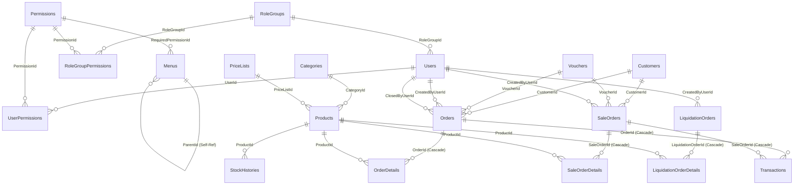

# TÀI LIỆU KIẾN TRÚC CƠ SỞ DỮ LIỆU (DATABASE SPECIFICATION)
## HỆ THỐNG QUẢN LÝ THUÊ & BÁN TRANG PHỤC (CLOTHING RENTAL SYSTEM)

> **Mục đích tài liệu:** Tài liệu này cung cấp sơ đồ quan hệ thực thể (ERD), định nghĩa chi tiết tất cả các bảng (tables), kiểu dữ liệu (data types), khóa chính (PK), khóa ngoại (FK), ràng buộc (constraints), cấu trúc tài liệu JSONB và chiến lược đánh chỉ mục (indexes). Tài liệu này được thiết kế để AI Agent hoặc Database Administrator (DBA) có thể tạo lập (migrate) cơ sở dữ liệu trên bất kỳ hệ quản trị CSDL quan hệ nào (PostgreSQL, MySQL, SQL Server, SQLite).

---

## MỤC LỤC
1. [SƠ ĐỒ QUAN HỆ THỰC THỂ (ENTITY RELATIONSHIP DIAGRAM - ERD)](#1-sơ-đồ-quan-hệ-thực-thể-entity-relationship-diagram---erd)
2. [DANH SÁCH BẢNG DỮ LIỆU TỔNG THỂ](#2-danh-sách-bảng-dữ-liệu-tổng-thể)
3. [CHI TIẾT ĐỊNH NGHĨA TỪNG BẢNG DỮ LIỆU](#3-chi-tiết-định-nghĩa-từng-bảng-dữ-liệu)
   * 3.1. Phân hệ Người dùng & Phân quyền (`Users`, `RoleGroups`, `Permissions`, `UserPermissions`, `RoleGroupPermissions`, `Menus`)
   * 3.2. Phân hệ Hàng hóa & Kho bãi (`Categories`, `PriceLists`, `Products`, `ProductAttributes`, `StockHistories`)
   * 3.3. Phân hệ Khách hàng & Khuyến mãi (`Customers`, `Vouchers`)
   * 3.4. Phân hệ Đơn hàng Thuê & Chi tiết (`Orders`, `OrderDetails`)
   * 3.5. Phân hệ Đơn hàng Bán đứt & Chi tiết (`SaleOrders`, `SaleOrderDetails`)
   * 3.6. Phân hệ Thanh lý & Chi tiết (`LiquidationOrders`, `LiquidationOrderDetails`)
   * 3.7. Phân hệ Sổ quỹ & Cấu hình (`Transactions`, `SystemSettings`)
4. [ĐẶC TẢ CẤU TRÚC CÁC TRƯỜNG DỮ LIỆU JSONB](#4-đặc-tả-cấu-trúc-các-trường-dữ-liệu-jsonb)
5. [DANH SÁCH CHỈ MỤC & TỐI ƯU HIỆU NĂNG (INDEXES)](#5-danh-sách-chỉ-mục--tối-ưu-hiệu-năng-indexes)
6. [DỮ LIỆU MẪU BAN ĐẦU (INITIAL SEED DATA)](#6-dữ-liệu-mẫu-ban-đầu-initial-seed-data)

---

## 1. SƠ ĐỒ QUAN HỆ THỰC THỂ (ENTITY RELATIONSHIP DIAGRAM - ERD)



---

## 2. DANH SÁCH BẢNG DỮ LIỆU TỔNG THỂ

| STT | Tên bảng (Table Name) | Nhóm chức năng | Ý nghĩa nghiệp vụ |
| :--- | :--- | :--- | :--- |
| 1 | `Users` | Quản trị | Tài khoản nhân viên, đăng nhập, thông tin liên hệ, ID Telegram |
| 2 | `RoleGroups` | Phân quyền | Nhóm vai trò mẫu (Quản trị viên, Thu ngân, Thủ kho, Kế toán) |
| 3 | `Permissions` | Phân quyền | Danh mục các mã quyền năng hạn ngạch trong hệ thống |
| 4 | `UserPermissions` | Phân quyền | Bảng trung gian gán quyền trực tiếp cho từng User |
| 5 | `RoleGroupPermissions` | Phân quyền | Bảng trung gian gán quyền cho Nhóm vai trò |
| 6 | `Menus` | Điều hướng | Cây menu thanh điều hướng sidebar và điều kiện quyền xem |
| 7 | `Categories` | Kho hàng | Danh mục loại sản phẩm (Váy cưới, Vest...), tiền tố sinh mã |
| 8 | `PriceLists` | Bảng giá | Bảng giá cho thuê 1 ngày, tiền cọc và danh sách quà tặng kèm |
| 9 | `ProductAttributes` | Cấu hình | Danh mục tên thuộc tính động (size, color, material, condition) |
| 10 | `Products` | Hàng hóa | Thông tin trang phục, mã barcode, tồn kho vật lý, số lượng đang thuê |
| 11 | `StockHistories` | Kho hàng | Lịch sử biến động xuất / nhập / thanh lý kho hàng |
| 12 | `Customers` | Khách hàng | Thông tin khách hàng, số điện thoại định danh, số CCCD |
| 13 | `Vouchers` | Khuyến mãi | Mã giảm giá theo số tiền cố định hoặc tỷ lệ phần trăm |
| 14 | `Orders` | Đơn thuê | Hợp đồng đơn hàng cho thuê trang phục, lịch thuê, dòng tiền |
| 15 | `OrderDetails` | Đơn thuê | Chi tiết từng trang phục / phụ kiện trong đơn thuê, tình trạng trả |
| 16 | `SaleOrders` | Đơn bán lẻ | Hóa đơn bán lẻ / bán đứt sản phẩm |
| 17 | `SaleOrderDetails` | Đơn bán lẻ | Chi tiết sản phẩm, số lượng và giá bán trong đơn bán lẻ |
| 18 | `LiquidationOrders` | Thanh lý | Phiếu xuất thanh lý loại bỏ đồ cũ/hỏng khỏi kho |
| 19 | `LiquidationOrderDetails`| Thanh lý | Chi tiết sản phẩm, số lượng và lý do xuất thanh lý |
| 20 | `Transactions` | Tài chính | Sổ quỹ ghi nhận mọi dòng tiền thu/chi thực tế |
| 21 | `SystemSettings` | Hệ thống | Cấu hình tham số cửa hàng, VietQR, in ấn, Telegram bot |

---

## 3. CHI TIẾT ĐỊNH NGHĨA TỪNG BẢNG DỮ LIỆU

### 3.1. Phân hệ Người dùng & Phân quyền

#### Bảng: `Users`
Lưu trữ thông tin tài khoản nhân viên và quản trị viên.

| Tên cột | Kiểu dữ liệu (PostgreSQL) | Nullable | Mặc định | Khóa / Ràng buộc | Mô tả nghiệp vụ |
| :--- | :--- | :--- | :--- | :--- | :--- |
| `Id` | `SERIAL` | **NO** | Auto | **PRIMARY KEY** | Mã định danh người dùng tự tăng |
| `Username` | `VARCHAR(100)` | **NO** | | **UNIQUE** | Tên đăng nhập hệ thống |
| `PasswordHash` | `TEXT` | **NO** | | | Chuỗi băm mật khẩu bảo mật (PBKDF2) |
| `FullName` | `VARCHAR(150)` | **NO** | `''` | | Họ và tên đầy đủ của nhân viên |
| `Role` | `VARCHAR(50)` | **NO** | `'Staff'` | | Vai trò chính: `'Admin'` hoặc `'Staff'` |
| `IsLocked` | `BOOLEAN` | **NO** | `FALSE` | | Trạng thái khóa tài khoản |
| `Email` | `VARCHAR(150)` | **NO** | `''` | | Địa chỉ email nhân viên |
| `PhoneNumber` | `VARCHAR(20)` | **NO** | `''` | | Số điện thoại liên hệ |
| `TelegramId` | `VARCHAR(50)` | **NO** | `''` | | Chat ID Telegram để nhận thông báo tự động |
| `RoleGroupId` | `INTEGER` | YES | `NULL` | **FK** $\rightarrow$ `RoleGroups(Id)` | Nhóm quyền mẫu gán cho người dùng (ON DELETE SET NULL) |

---

#### Bảng: `RoleGroups`
Nhóm quyền định sẵn (vai trò phân quyền mẫu).

| Tên cột | Kiểu dữ liệu | Nullable | Mặc định | Khóa / Ràng buộc | Mô tả nghiệp vụ |
| :--- | :--- | :--- | :--- | :--- | :--- |
| `Id` | `SERIAL` | **NO** | Auto | **PRIMARY KEY** | Mã định danh nhóm quyền |
| `Name` | `VARCHAR(150)` | **NO** | | | Tên nhóm quyền (VD: Quản trị viên, Thu ngân...) |
| `Description` | `TEXT` | YES | `NULL` | | Mô tả chức trách của nhóm quyền |
| `CreatedAt` | `TIMESTAMPTZ` | **NO** | `NOW()` | | Thời điểm tạo nhóm quyền |

---

#### Bảng: `Permissions`
Danh mục quyền năng hạn ngạch trong hệ thống.

| Tên cột | Kiểu dữ liệu | Nullable | Mặc định | Khóa / Ràng buộc | Mô tả nghiệp vụ |
| :--- | :--- | :--- | :--- | :--- | :--- |
| `Id` | `SERIAL` | **NO** | Auto | **PRIMARY KEY** | Mã định danh quyền |
| `Code` | `VARCHAR(100)` | **NO** | | **UNIQUE** | Mã quyền chuẩn (VD: `ORDER_CREATE`, `REPORT_VIEW`) |
| `Name` | `VARCHAR(150)` | **NO** | | | Tên hiển thị quyền trên màn hình phân quyền |
| `Type` | `VARCHAR(50)` | **NO** | | | Phân loại quyền: `'UI'` (truy cập menu) hoặc `'Action'` (thao tác nút bấm) |
| `Description` | `TEXT` | YES | `NULL` | | Giải thích chi tiết phạm vi quyền |

---

#### Bảng: `UserPermissions`
Bảng trung gian liên kết Nhiều - Nhiều giữa Người dùng và Quyền (phân quyền trực tiếp theo từng tài khoản).

| Tên cột | Kiểu dữ liệu | Nullable | Mặc định | Khóa / Ràng buộc | Mô tả nghiệp vụ |
| :--- | :--- | :--- | :--- | :--- | :--- |
| `UserId` | `INTEGER` | **NO** | | **PK, FK** $\rightarrow$ `Users(Id)` | Mã người dùng (ON DELETE CASCADE) |
| `PermissionId` | `INTEGER` | **NO** | | **PK, FK** $\rightarrow$ `Permissions(Id)` | Mã quyền (ON DELETE CASCADE) |
* **Composite Primary Key:** `(UserId, PermissionId)`.

---

#### Bảng: `RoleGroupPermissions`
Bảng trung gian liên kết Nhiều - Nhiều giữa Nhóm quyền và Quyền.

| Tên cột | Kiểu dữ liệu | Nullable | Mặc định | Khóa / Ràng buộc | Mô tả nghiệp vụ |
| :--- | :--- | :--- | :--- | :--- | :--- |
| `RoleGroupId` | `INTEGER` | **NO** | | **PK, FK** $\rightarrow$ `RoleGroups(Id)` | Mã nhóm quyền (ON DELETE CASCADE) |
| `PermissionId` | `INTEGER` | **NO** | | **PK, FK** $\rightarrow$ `Permissions(Id)` | Mã quyền (ON DELETE CASCADE) |
* **Composite Primary Key:** `(RoleGroupId, PermissionId)`.

---

#### Bảng: `Menus`
Cấu hình cây danh mục điều hướng Sidebar động.

| Tên cột | Kiểu dữ liệu | Nullable | Mặc định | Khóa / Ràng buộc | Mô tả nghiệp vụ |
| :--- | :--- | :--- | :--- | :--- | :--- |
| `Id` | `SERIAL` | **NO** | Auto | **PRIMARY KEY** | Mã định danh menu |
| `Name` | `VARCHAR(150)` | **NO** | | | Tiêu đề hiển thị trên thanh menu |
| `Url` | `VARCHAR(250)` | **NO** | | | Đường dẫn trang web (hoặc `'#'` nếu là menu cha) |
| `Icon` | `VARCHAR(50)` | YES | `NULL` | | Biểu tượng icon (Emoji hoặc FontAwesome) |
| `ParentId` | `INTEGER` | YES | `NULL` | **FK** $\rightarrow$ `Menus(Id)` | Tự đệ quy trỏ đến menu cha (ON DELETE SET NULL) |
| `DisplayOrder` | `INTEGER` | **NO** | `0` | | Thứ tự sắp xếp hiển thị từ trên xuống dưới |
| `RequiredPermissionId`| `INTEGER` | YES | `NULL` | **FK** $\rightarrow$ `Permissions(Id)` | Quyền cần có để nhìn thấy menu này (ON DELETE SET NULL) |

---

### 3.2. Phân hệ Hàng hóa & Kho bãi

#### Bảng: `Categories`
Danh mục loại mặt hàng trang phục.

| Tên cột | Kiểu dữ liệu | Nullable | Mặc định | Khóa / Ràng buộc | Mô tả nghiệp vụ |
| :--- | :--- | :--- | :--- | :--- | :--- |
| `Id` | `SERIAL` | **NO** | Auto | **PRIMARY KEY** | Mã định danh loại hàng |
| `Name` | `VARCHAR(150)` | **NO** | | | Tên loại hàng (Váy cưới, Vest, Áo dài...) |
| `CodePrefix` | `VARCHAR(10)` | **NO** | | **UNIQUE** | Tiền tố sinh mã sản phẩm (VC, VS, AD, PK...) |
| `Description` | `TEXT` | YES | `NULL` | | Mô tả chi tiết loại hàng |
| `SystemLog` | `JSONB` | **NO** | `'[]'` | | Nhật ký chỉnh sửa loại hàng theo thời gian |
| `IsActive` | `BOOLEAN` | **NO** | `TRUE` | | Trạng thái còn sử dụng hay không |
| `CreatedAt` | `TIMESTAMPTZ` | **NO** | `NOW()` | | Thời điểm tạo bản ghi |
| `UpdatedAt` | `TIMESTAMPTZ` | **NO** | `NOW()` | | Thời điểm cập nhật cuối cùng |

---

#### Bảng: `PriceLists`
Bảng giá cho thuê chuẩn hóa.

| Tên cột | Kiểu dữ liệu | Nullable | Mặc định | Khóa / Ràng buộc | Mô tả nghiệp vụ |
| :--- | :--- | :--- | :--- | :--- | :--- |
| `Id` | `SERIAL` | **NO** | Auto | **PRIMARY KEY** | Mã bảng giá |
| `Name` | `VARCHAR(150)` | **NO** | | | Tên loại giá (VD: "VIP", "50K", "100K", "Cơ Bản") |
| `PricePerDay` | `DECIMAL(18,2)`| **NO** | `0` | | Đơn giá cho thuê 1 ngày (1 chu kỳ ngày) |
| `Deposit` | `DECIMAL(18,2)`| **NO** | `0` | | Tiền cọc mặc định khi thuê đồ |
| `Description` | `TEXT` | YES | `NULL` | | Mô tả bảng giá |
| `GiftProductsJson`| `JSONB` | **NO** | `'[]'` | | Danh sách phụ kiện tặng kèm miễn phí tự động |
| `SystemLog` | `JSONB` | **NO** | `'[]'` | | Nhật ký biến động giá |
| `IsActive` | `BOOLEAN` | **NO** | `TRUE` | | Trạng thái áp dụng bảng giá |
| `CreatedAt` | `TIMESTAMPTZ` | **NO** | `NOW()` | | Thời điểm tạo |
| `UpdatedAt` | `TIMESTAMPTZ` | **NO** | `NOW()` | | Thời điểm cập nhật |

---

#### Bảng: `ProductAttributes`
Danh mục thuộc tính động của sản phẩm.

| Tên cột | Kiểu dữ liệu | Nullable | Mặc định | Khóa / Ràng buộc | Mô tả nghiệp vụ |
| :--- | :--- | :--- | :--- | :--- | :--- |
| `Id` | `SERIAL` | **NO** | Auto | **PRIMARY KEY** | Mã thuộc tính |
| `Key` | `VARCHAR(50)` | **NO** | | **UNIQUE** | Khóa định danh (VD: `size`, `material`, `color`) |
| `DisplayName` | `VARCHAR(100)` | **NO** | | | Nhãn hiển thị tiếng Việt (VD: Kích thước, Chất liệu) |
| `Description` | `TEXT` | YES | `NULL` | | Giải thích thuộc tính |
| `IsActive` | `BOOLEAN` | **NO** | `TRUE` | | Trạng thái hoạt động |

---

#### Bảng: `Products`
Trang phục, đạo cụ và sản phẩm kinh doanh trong cửa hàng.

| Tên cột | Kiểu dữ liệu | Nullable | Mặc định | Khóa / Ràng buộc | Mô tả nghiệp vụ |
| :--- | :--- | :--- | :--- | :--- | :--- |
| `Id` | `SERIAL` | **NO** | Auto | **PRIMARY KEY** | Mã số nội bộ sản phẩm |
| `Code` | `VARCHAR(50)` | **NO** | | **UNIQUE** | Mã vạch sản phẩm: `Prefix + STT(4 số)` |
| `Name` | `VARCHAR(200)` | **NO** | | | Tên sản phẩm / Tên bộ trang phục |
| `CategoryId` | `INTEGER` | **NO** | | **FK** $\rightarrow$ `Categories(Id)` | Thuộc loại hàng nào (ON DELETE RESTRICT) |
| `PriceListId` | `INTEGER` | **NO** | | **FK** $\rightarrow$ `PriceLists(Id)` | Áp dụng bảng giá nào (ON DELETE RESTRICT) |
| `Color` | `VARCHAR(50)` | YES | `NULL` | | Màu sắc trang phục |
| `Size` | `VARCHAR(50)` | YES | `NULL` | | Kích cỡ (S, M, L, XL, FreeSize...) |
| `Material` | `VARCHAR(100)` | YES | `NULL` | | Chất liệu vải |
| `Condition` | `VARCHAR(100)` | YES | `NULL` | | Tình trạng đồ ban đầu (Mới 100%, 95%...) |
| `DynamicAttributes`| `JSONB` | **NO** | `'[]'` | | Mảng thuộc tính động mở rộng |
| `Description` | `TEXT` | YES | `NULL` | | Ghi chú thêm về trang phục |
| `ImportPrice` | `DECIMAL(18,2)`| **NO** | `0` | | Giá nhập hàng (dùng để tính ROI khi thanh lý) |
| `ImageUrl` | `TEXT` | YES | `NULL` | | Đường dẫn URL ảnh (chuỗi đơn hoặc JSON array) |
| `StockQuantity`| `INTEGER` | **NO** | `0` | | **Tổng số lượng thực tế cửa hàng sở hữu** |
| `RentedQuantity`| `INTEGER` | **NO** | `0` | | **Số lượng chiếc hiện đang được khách thuê ngoài** |
| `WarningStockLevel`| `INTEGER` | **NO** | `0` | | Ngưỡng tồn kho tối thiểu cảnh báo sắp hết |
| `TotalRentRevenue`| `DECIMAL(18,2)`| **NO** | `0` | | Tổng doanh thu thuê tích lũy qua các lần thuê |
| `IsAvailable` | `BOOLEAN` | **NO** | `TRUE` | | Cho phép khách thuê/bán hay đang khóa |
| `IsLiquidated` | `BOOLEAN` | **NO** | `FALSE` | | Đã xuất thanh lý loại bỏ hoàn toàn chưa |
| `SystemLog` | `JSONB` | **NO** | `'[]'` | | Lịch sử chỉnh sửa sản phẩm |

---

#### Bảng: `StockHistories`
Ghi nhận toàn bộ biến động số lượng tồn kho của sản phẩm.

| Tên cột | Kiểu dữ liệu | Nullable | Mặc định | Khóa / Ràng buộc | Mô tả nghiệp vụ |
| :--- | :--- | :--- | :--- | :--- | :--- |
| `Id` | `SERIAL` | **NO** | Auto | **PRIMARY KEY** | Mã dòng lịch sử kho |
| `ProductId` | `INTEGER` | **NO** | | **FK** $\rightarrow$ `Products(Id)` | Mã sản phẩm (ON DELETE CASCADE) |
| `ActionType` | `VARCHAR(50)` | **NO** | | | Loại thao tác: `IMPORT`, `SALE`, `LIQUIDATE`, `LOSS_DAMAGE` |
| `QuantityChange`| `INTEGER` | **NO** | | | Số lượng biến động ($+$ tăng, $-$ giảm) |
| `RemainingTotal`| `INTEGER` | **NO** | `0` | | Tồn kho thực tế còn lại sau thao tác |
| `ReferenceCode` | `VARCHAR(100)` | YES | `NULL` | | Mã chứng từ liên quan (Mã đơn bán, Mã phiếu thanh lý) |
| `Note` | `TEXT` | YES | `NULL` | | Ghi chú lý do xuất nhập |
| `PerformedBy` | `VARCHAR(100)` | **NO** | | | Tên tài khoản nhân viên thao tác |
| `CreatedAt` | `TIMESTAMPTZ` | **NO** | `NOW()` | | Thời điểm phát sinh giao dịch kho |

---

### 3.3. Phân hệ Khách hàng & Khuyến mãi

#### Bảng: `Customers`
Hồ sơ khách hàng thuê và mua trang phục.

| Tên cột | Kiểu dữ liệu | Nullable | Mặc định | Khóa / Ràng buộc | Mô tả nghiệp vụ |
| :--- | :--- | :--- | :--- | :--- | :--- |
| `Id` | `SERIAL` | **NO** | Auto | **PRIMARY KEY** | Mã khách hàng |
| `FullName` | `VARCHAR(150)` | **NO** | | | Họ và tên khách hàng |
| `PhoneNumber` | `VARCHAR(15)` | **NO** | | **UNIQUE** | Số điện thoại (Khóa định danh tìm kiếm nhanh) |
| `IdentityCard` | `VARCHAR(20)` | YES | `NULL` | | Số Căn cước công dân (CCCD) / CMND |
| `Address` | `VARCHAR(250)` | YES | `NULL` | | Địa chỉ khách hàng |
| `Status` | `VARCHAR(20)` | **NO** | `'Active'` | | Trạng thái: `'Active'` hoặc `'Blacklisted'` |
| `Notes` | `TEXT` | YES | `NULL` | | Ghi chú đặc biệt về khách (thói quen, lịch sử hỏng đồ) |
| `CreatedAt` | `TIMESTAMPTZ` | **NO** | `NOW()` | | Thời điểm tạo hồ sơ |

---

#### Bảng: `Vouchers`
Mã giảm giá và chính sách khuyến mãi.

| Tên cột | Kiểu dữ liệu | Nullable | Mặc định | Khóa / Ràng buộc | Mô tả nghiệp vụ |
| :--- | :--- | :--- | :--- | :--- | :--- |
| `Id` | `SERIAL` | **NO** | Auto | **PRIMARY KEY** | Mã voucher nội bộ |
| `Code` | `VARCHAR(50)` | **NO** | | **UNIQUE** | Mã giảm giá viết hoa (VD: `SUMMER50`, `SALE10`) |
| `Name` | `VARCHAR(200)` | **NO** | | | Tên chương trình ưu đãi |
| `DiscountType` | `VARCHAR(20)` | **NO** | `'FIXED'` | | Loại chiết khấu: `'FIXED'` (cố định) hoặc `'PERCENT'` (%) |
| `DiscountValue`| `DECIMAL(18,2)`| **NO** | `0` | | Mức giảm: ví dụ `50000` (đồng) hoặc `10` (%) |
| `MaxDiscountAmount`| `DECIMAL(18,2)`| YES | `NULL` | | Số tiền giảm tối đa (áp dụng khi loại là `PERCENT`) |
| `MinOrderAmount`| `DECIMAL(18,2)`| **NO** | `0` | | Giá trị đơn hàng tối thiểu để được áp dụng |
| `MaxUsageCount` | `INTEGER` | YES | `NULL` | | Tổng lượt dùng tối đa (`NULL` = không giới hạn) |
| `UsedCount` | `INTEGER` | **NO** | `0` | | Số lượt đã sử dụng thực tế |
| `StartDate` | `TIMESTAMPTZ` | **NO** | `NOW()` | | Thời điểm bắt đầu hiệu lực |
| `EndDate` | `TIMESTAMPTZ` | **NO** | | | Thời điểm hết hạn voucher |
| `IsActive` | `BOOLEAN` | **NO** | `TRUE` | | Trạng thái kích hoạt |
| `Description` | `TEXT` | YES | `NULL` | | Mô tả chi tiết thể lệ chương trình |
| `CreatedAt` | `TIMESTAMPTZ` | **NO** | `NOW()` | | Thời điểm tạo |

---

### 3.4. Phân hệ Đơn hàng Thuê & Chi tiết

#### Bảng: `Orders`
Hợp đồng cho thuê trang phục.

| Tên cột | Kiểu dữ liệu | Nullable | Mặc định | Khóa / Ràng buộc | Mô tả nghiệp vụ |
| :--- | :--- | :--- | :--- | :--- | :--- |
| `Id` | `SERIAL` | **NO** | Auto | **PRIMARY KEY** | Mã đơn thuê |
| `Code` | `VARCHAR(50)` | **NO** | | **UNIQUE** | Mã đơn: `HD + yyMMdd + STT(4 số)` |
| `CustomerId` | `INTEGER` | **NO** | | **FK** $\rightarrow$ `Customers(Id)` | Khách hàng thuê (ON DELETE RESTRICT) |
| `RentDate` | `TIMESTAMPTZ` | **NO** | `NOW()` | | Thời điểm bắt đầu nhận đồ thuê |
| `DueDate` | `TIMESTAMPTZ` | **NO** | `NOW()` | | Hạn cuối cùng phải trả đồ |
| `ActualReturnDate`| `TIMESTAMPTZ`| YES | `NULL` | | Thời điểm thực tế khách trả hết toàn bộ đồ |
| `TotalPrice` | `DECIMAL(18,2)`| **NO** | `0` | | Tổng tiền thuê gốc của tất cả sản phẩm trong đơn |
| `TotalDeposit` | `DECIMAL(18,2)`| **NO** | `0` | | Tổng tiền cọc cần thu của toàn đơn |
| `TotalPenalty` | `DECIMAL(18,2)`| **NO** | `0` | | Tổng tiền phạt phát sinh (trễ hạn + làm hỏng đồ) |
| `DiscountAmount`| `DECIMAL(18,2)`| **NO** | `0` | | Tiền chiết khấu giảm giá từ Voucher |
| `FinalAmount` | `DECIMAL(18,2)`| **NO** | `0` | | Tổng tiền thực tế khách phải trả $= TotalPrice - Discount + Penalty$ |
| `Status` | `VARCHAR(20)` | **NO** | `'Draft'` | | Trạng thái: `Draft`, `Reserved`, `Rented`, `PartiallyReturned`, `Closed` |
| `DepositStatus`| `VARCHAR(20)` | **NO** | `'None'` | | Tình trạng cọc: `None`, `Holding`, `Refunded`, `Charged` |
| `OrderType` | `VARCHAR(20)` | **NO** | `'Rental'` | | Loại đơn hàng (Mặc định: `'Rental'`) |
| `AttachmentUrl`| `TEXT` | YES | `NULL` | | JSON mảng ảnh đính kèm (ảnh khách thử đồ, biên nhận) |
| `Notes` | `TEXT` | YES | `NULL` | | Ghi chú đơn thuê |
| `IsIdCardReceived`| `BOOLEAN` | **NO** | `FALSE` | | Cờ xác nhận cửa hàng có đang giữ CCCD của khách |
| `CreatedByUserId`| `INTEGER` | YES | `NULL` | **FK** $\rightarrow$ `Users(Id)` | Nhân viên lập đơn (ON DELETE RESTRICT) |
| `ClosedByUserId` | `INTEGER` | YES | `NULL` | **FK** $\rightarrow$ `Users(Id)` | Nhân viên chốt trả đồ và đóng đơn (ON DELETE RESTRICT) |
| `VoucherId` | `INTEGER` | YES | `NULL` | **FK** $\rightarrow$ `Vouchers(Id)` | Voucher áp dụng (ON DELETE SET NULL) |
| `CreatedAt` | `TIMESTAMPTZ` | **NO** | `NOW()` | | Thời điểm tạo đơn |

---

#### Bảng: `OrderDetails`
Chi tiết từng sản phẩm và phụ kiện trong đơn thuê.

| Tên cột | Kiểu dữ liệu | Nullable | Mặc định | Khóa / Ràng buộc | Mô tả nghiệp vụ |
| :--- | :--- | :--- | :--- | :--- | :--- |
| `Id` | `SERIAL` | **NO** | Auto | **PRIMARY KEY** | Mã dòng chi tiết |
| `OrderId` | `INTEGER` | **NO** | | **FK** $\rightarrow$ `Orders(Id)` | Thuộc đơn thuê nào (ON DELETE CASCADE) |
| `ProductId` | `INTEGER` | **NO** | | **FK** $\rightarrow$ `Products(Id)` | Trang phục thuê (ON DELETE RESTRICT) |
| `RentPrice` | `DECIMAL(18,2)`| **NO** | `0` | | Tiền thuê chốt tại thời điểm lập đơn |
| `Deposit` | `DECIMAL(18,2)`| **NO** | `0` | | Tiền cọc chốt tại thời điểm lập đơn |
| `PricePerDay` | `DECIMAL(18,2)`| **NO** | `0` | | Đơn giá thuê 1 ngày tại thời điểm thuê |
| `AddAmt` | `DECIMAL(18,2)`| **NO** | `0` | | Phụ thu riêng lẻ của sản phẩm này |
| `DeductAmt` | `DECIMAL(18,2)`| **NO** | `0` | | Giảm trừ riêng lẻ của sản phẩm này |
| `RentDays` | `INTEGER` | **NO** | `1` | | Số ngày thuê dự kiến ban đầu |
| `ExtendedDays` | `INTEGER` | **NO** | `0` | | Số ngày khách xin gia hạn thêm |
| `PenaltyFee` | `DECIMAL(18,2)`| **NO** | `0` | | Tiền phạt phát sinh cho sản phẩm này (trễ / hỏng) |
| `PenaltyReason`| `TEXT` | YES | `NULL` | | Lý do phạt (VD: "Trễ 2 ngày", "Rách tà váy") |
| `IsPenaltyPaid`| `BOOLEAN` | **NO** | `FALSE` | | Đã thu tiền phạt trước hay chưa |
| `IsReturned` | `BOOLEAN` | **NO** | `FALSE` | | Khách đã mang sản phẩm này trả về kho chưa |
| `ReturnDate` | `TIMESTAMPTZ` | YES | `NULL` | | Thời điểm thực tế sản phẩm này được hoàn trả |
| `ConditionAtReceive`| `TEXT` | YES | `NULL` | | Đánh giá tình trạng đồ khi nhận lại từ khách |
| `IsGift` | `BOOLEAN` | **NO** | `FALSE` | | Có phải phụ kiện tặng kèm miễn phí không |
| `ParentProductId`| `INTEGER` | YES | `NULL` | **FK** $\rightarrow$ `Products(Id)` | Gắn liền với trang phục chính nào (ON DELETE SET NULL) |

---

### 3.5. Phân hệ Đơn hàng Bán đứt & Chi tiết

#### Bảng: `SaleOrders`
Hóa đơn bán lẻ trang phục / phụ kiện.

| Tên cột | Kiểu dữ liệu | Nullable | Mặc định | Khóa / Ràng buộc | Mô tả nghiệp vụ |
| :--- | :--- | :--- | :--- | :--- | :--- |
| `Id` | `SERIAL` | **NO** | Auto | **PRIMARY KEY** | Mã đơn bán đứt |
| `Code` | `VARCHAR(50)` | **NO** | | **UNIQUE** | Mã đơn bán: `MD + yyMMdd + STT(4 số)` |
| `CustomerId` | `INTEGER` | **NO** | | **FK** $\rightarrow$ `Customers(Id)` | Khách hàng mua (ON DELETE RESTRICT) |
| `SaleDate` | `TIMESTAMPTZ` | **NO** | `NOW()` | | Thời điểm bán hàng |
| `TotalPrice` | `DECIMAL(18,2)`| **NO** | `0` | | Tổng tiền hàng trước giảm giá |
| `DiscountAmount`| `DECIMAL(18,2)`| **NO** | `0` | | Số tiền giảm giá từ Voucher |
| `FinalAmount` | `DECIMAL(18,2)`| **NO** | `0` | | Tiền khách thanh toán $= TotalPrice - Discount$ |
| `Status` | `VARCHAR(20)` | **NO** | `'Draft'` | | Trạng thái: `'Draft'`, `'Closed'`, `'Cancelled'` |
| `Notes` | `TEXT` | YES | `NULL` | | Ghi chú đơn bán |
| `AttachmentUrl`| `TEXT` | YES | `NULL` | | JSON mảng ảnh đính kèm |
| `CreatedByUserId`| `INTEGER` | YES | `NULL` | **FK** $\rightarrow$ `Users(Id)` | Thu ngân tạo đơn (ON DELETE RESTRICT) |
| `VoucherId` | `INTEGER` | YES | `NULL` | **FK** $\rightarrow$ `Vouchers(Id)` | Mã giảm giá (ON DELETE SET NULL) |
| `CreatedAt` | `TIMESTAMPTZ` | **NO** | `NOW()` | | Thời điểm tạo |

---

#### Bảng: `SaleOrderDetails`
Chi tiết sản phẩm xuất bán đứt.

| Tên cột | Kiểu dữ liệu | Nullable | Mặc định | Khóa / Ràng buộc | Mô tả nghiệp vụ |
| :--- | :--- | :--- | :--- | :--- | :--- |
| `Id` | `SERIAL` | **NO** | Auto | **PRIMARY KEY** | Mã dòng |
| `SaleOrderId` | `INTEGER` | **NO** | | **FK** $\rightarrow$ `SaleOrders(Id)` | Thuộc đơn bán nào (ON DELETE CASCADE) |
| `ProductId` | `INTEGER` | **NO** | | **FK** $\rightarrow$ `Products(Id)` | Sản phẩm bán (ON DELETE RESTRICT) |
| `Price` | `DECIMAL(18,2)`| **NO** | `0` | | Đơn giá xuất bán mỗi chiếc |
| `Quantity` | `INTEGER` | **NO** | `1` | | Số lượng xuất bán |

---

### 3.6. Phân hệ Thanh lý & Chi tiết

#### Bảng: `LiquidationOrders`
Phiếu xuất thanh lý trang phục quá cũ / hỏng hóc.

| Tên cột | Kiểu dữ liệu | Nullable | Mặc định | Khóa / Ràng buộc | Mô tả nghiệp vụ |
| :--- | :--- | :--- | :--- | :--- | :--- |
| `Id` | `SERIAL` | **NO** | Auto | **PRIMARY KEY** | Mã phiếu thanh lý |
| `Code` | `VARCHAR(50)` | **NO** | | **UNIQUE** | Mã phiếu: `TL + yyMMdd + STT(4 số)` |
| `LiquidationDate`| `TIMESTAMPTZ`| **NO** | `NOW()` | | Ngày thực hiện thanh lý |
| `Status` | `VARCHAR(20)` | **NO** | `'Completed'`| | Trạng thái: `'Completed'`, `'Cancelled'` |
| `Notes` | `TEXT` | YES | `NULL` | | Ghi chú lý do thanh lý đợt này |
| `CreatedByUserId`| `INTEGER` | YES | `NULL` | **FK** $\rightarrow$ `Users(Id)` | Người duyệt thanh lý (ON DELETE RESTRICT) |
| `CreatedAt` | `TIMESTAMPTZ` | **NO** | `NOW()` | | Thời điểm tạo |

---

#### Bảng: `LiquidationOrderDetails`
Chi tiết các món đồ thanh lý trong phiếu.

| Tên cột | Kiểu dữ liệu | Nullable | Mặc định | Khóa / Ràng buộc | Mô tả nghiệp vụ |
| :--- | :--- | :--- | :--- | :--- | :--- |
| `Id` | `SERIAL` | **NO** | Auto | **PRIMARY KEY** | Mã dòng |
| `LiquidationOrderId`| `INTEGER` | **NO** | | **FK** $\rightarrow$ `LiquidationOrders(Id)` | Thuộc phiếu nào (ON DELETE CASCADE) |
| `ProductId` | `INTEGER` | **NO** | | **FK** $\rightarrow$ `Products(Id)` | Sản phẩm thanh lý (ON DELETE RESTRICT) |
| `Quantity` | `INTEGER` | **NO** | `1` | | Số lượng thanh lý trừ khỏi kho |
| `Reason` | `VARCHAR(500)` | YES | `NULL` | | Lý do cụ thể (rách tà, ố vàng, hỏng khóa...) |

---

### 3.7. Phân hệ Sổ quỹ & Cấu hình

#### Bảng: `Transactions`
Sổ quỹ dòng tiền thu / chi phát sinh từ hoạt động kinh doanh.

| Tên cột | Kiểu dữ liệu | Nullable | Mặc định | Khóa / Ràng buộc | Mô tả nghiệp vụ |
| :--- | :--- | :--- | :--- | :--- | :--- |
| `Id` | `SERIAL` | **NO** | Auto | **PRIMARY KEY** | Mã giao dịch |
| `OrderId` | `INTEGER` | YES | `NULL` | **FK** $\rightarrow$ `Orders(Id)` | Liên kết đơn thuê nếu có (ON DELETE CASCADE) |
| `SaleOrderId` | `INTEGER` | YES | `NULL` | **FK** $\rightarrow$ `SaleOrders(Id)` | Liên kết đơn bán nếu có (ON DELETE CASCADE) |
| `Type` | `VARCHAR(30)` | **NO** | | | Loại GD: `DEPOSIT_RECEIVED`, `RENTAL_PAYMENT`, `PENALTY_PAYMENT`, `DEPOSIT_REFUNDED`, `SALE_PAYMENT`... |
| `PaymentMethod`| `VARCHAR(20)` | **NO** | `'CASH'` | | Phương thức: `'CASH'`, `'TRANSFER'`, `'CARD'` |
| `Amount` | `DECIMAL(18,2)`| **NO** | `0` | | Số tiền phát sinh của giao dịch |
| `TransactionDate`| `TIMESTAMPTZ`| **NO** | `NOW()` | | Thời điểm giao dịch thực tế |
| `PerformedBy` | `VARCHAR(100)` | **NO** | | | Username nhân viên thực hiện thu / chi |
| `ReferenceCode`| `VARCHAR(100)` | YES | `NULL` | | Mã tham chiếu (mã ngân hàng, mã đơn) |
| `Notes` | `VARCHAR(250)` | YES | `NULL` | | Ghi chú diễn giải nội dung giao dịch |

---

#### Bảng: `SystemSettings`
Lưu trữ cấu hình toàn cục của hệ thống dạng Key-Value (JSONB).

| Tên cột | Kiểu dữ liệu | Nullable | Mặc định | Khóa / Ràng buộc | Mô tả nghiệp vụ |
| :--- | :--- | :--- | :--- | :--- | :--- |
| `Key` | `VARCHAR(100)` | **NO** | | **PRIMARY KEY** | Khóa cấu hình duy nhất |
| `ValueJson` | `JSONB` | **NO** | | | Nội dung giá trị đóng gói JSON (`{"value": "...", "description": "..."}`) |
| `UpdatedAt` | `TIMESTAMPTZ` | **NO** | `NOW()` | | Thời điểm cập nhật giá trị gần nhất |

---

## 4. ĐẶC TẢ CẤU TRÚC CÁC TRƯỜNG DỮ LIỆU JSONB

### 4.1. `Product.DynamicAttributes`
Lưu mảng các thuộc tính động của sản phẩm:
```json
[
  {
    "key": "size",
    "display": "Kích cỡ",
    "value": "XL"
  },
  {
    "key": "color",
    "display": "Màu sắc",
    "value": "Đỏ đô"
  },
  {
    "key": "material",
    "display": "Chất liệu",
    "value": "Gấm thêu kim tuyến"
  },
  {
    "key": "condition",
    "display": "Tình trạng",
    "value": "Mới 98%"
  }
]
```

### 4.2. `PriceList.GiftProductsJson`
Lưu danh sách các mặt hàng phụ kiện tặng kèm tự động:
```json
[
  {
    "productId": 14,
    "quantity": 1
  },
  {
    "productId": 28,
    "quantity": 2
  }
]
```

### 4.3. `SystemLog` (Tại `Products`, `Categories`, `PriceLists`)
Lưu vết lịch sử thay đổi thông tin:
```json
[
  {
    "timestamp": "2026-09-04T08:30:00Z",
    "user": "admin",
    "action": "UPDATE_PRICE",
    "oldValue": "100000",
    "newValue": "120000"
  }
]
```

### 4.4. `SystemSetting.ValueJson`
Định dạng lưu trữ tham số hệ thống:
```json
{
  "value": "9495Comi Studio",
  "description": "Tên cửa hàng in trên đầu hóa đơn"
}
```

---

## 5. DANH SÁCH CHỈ MỤC & TỐI ƯU HIỆU NĂNG (INDEXES)

Để đảm bảo hệ thống phản hồi dưới 50ms khi dữ liệu đạt hàng trăm nghìn đơn hàng:

```sql
-- 1. Các chỉ mục duy nhất (Unique Indexes)
CREATE UNIQUE INDEX IF NOT EXISTS "IX_Users_Username" ON "Users" ("Username");
CREATE UNIQUE INDEX IF NOT EXISTS "IX_Customers_PhoneNumber" ON "Customers" ("PhoneNumber");
CREATE UNIQUE INDEX IF NOT EXISTS "IX_Vouchers_Code" ON "Vouchers" ("Code");
CREATE UNIQUE INDEX IF NOT EXISTS "IX_Categories_CodePrefix" ON "Categories" ("CodePrefix");
CREATE UNIQUE INDEX IF NOT EXISTS "IX_Products_Code" ON "Products" ("Code");
CREATE UNIQUE INDEX IF NOT EXISTS "IX_Orders_Code" ON "Orders" ("Code");
CREATE UNIQUE INDEX IF NOT EXISTS "IX_SaleOrders_Code" ON "SaleOrders" ("Code");
CREATE UNIQUE INDEX IF NOT EXISTS "IX_LiquidationOrders_Code" ON "LiquidationOrders" ("Code");

-- 2. Chỉ mục tìm kiếm khách hàng & lịch sử đơn
CREATE INDEX IF NOT EXISTS "IX_Orders_CustomerId" ON "Orders" ("CustomerId");
CREATE INDEX IF NOT EXISTS "IX_Orders_RentDate_DueDate" ON "Orders" ("RentDate", "DueDate");
CREATE INDEX IF NOT EXISTS "IX_Orders_Status" ON "Orders" ("Status");
CREATE INDEX IF NOT EXISTS "IX_Orders_CreatedAt" ON "Orders" ("CreatedAt");

-- 3. Chỉ mục kiểm tra xung đột trùng lịch thuê (Overlapping check)
CREATE INDEX IF NOT EXISTS "IX_OrderDetails_ProductId_OrderId" ON "OrderDetails" ("ProductId", "OrderId");
CREATE INDEX IF NOT EXISTS "IX_OrderDetails_IsReturned" ON "OrderDetails" ("IsReturned");

-- 4. Chỉ mục truy vấn sổ quỹ giao dịch theo thời gian & người thực hiện
CREATE INDEX IF NOT EXISTS "IX_Transactions_TransactionDate" ON "Transactions" ("TransactionDate");
CREATE INDEX IF NOT EXISTS "IX_Transactions_PerformedBy" ON "Transactions" ("PerformedBy");
CREATE INDEX IF NOT EXISTS "IX_Transactions_OrderId" ON "Transactions" ("OrderId");
CREATE INDEX IF NOT EXISTS "IX_Transactions_SaleOrderId" ON "Transactions" ("SaleOrderId");
CREATE INDEX IF NOT EXISTS "IX_Transactions_Type" ON "Transactions" ("Type");

-- 5. Chỉ mục kho hàng
CREATE INDEX IF NOT EXISTS "IX_Products_CategoryId" ON "Products" ("CategoryId");
CREATE INDEX IF NOT EXISTS "IX_Products_PriceListId" ON "Products" ("PriceListId");
CREATE INDEX IF NOT EXISTS "IX_Products_StockQuantity" ON "Products" ("StockQuantity");
CREATE INDEX IF NOT EXISTS "IX_Products_IsAvailable_IsLiquidated" ON "Products" ("IsAvailable", "IsLiquidated");
```

---

## 6. DỮ LIỆU MẪU BAN ĐẦU (INITIAL SEED DATA)

### 6.1. Tài khoản Quản trị viên mặc định (`Users`)
* `Username`: `admin`
* `FullName`: `Administrator`
* `Role`: `Admin`
* `Password`: `admin` (Được băm bằng thuật toán bảo mật PBKDF2).

### 6.2. 28 Quyền năng mặc định (`Permissions`)
1. `REPORT_VIEW`, `REPORT_TRANSACTIONS`, `REPORT_CLOSED_ORDERS`, `REPORT_OPEN_ORDERS`, `REPORT_PRODUCT_SALES`, `REPORT_ID_CARDS`, `REPORT_STAFF_REVENUE`, `REPORT_LOW_STOCK`.
2. `CLOTHES_VIEW`, `CLOTHES_CREATE`, `CLOTHES_EDIT`, `CLOTHES_LOCK`, `CLOTHES_DELETE`, `CLOTHES_IMPORT_HISTORY`.
3. `CATEGORY_VIEW`, `CATEGORY_CREATE`, `CATEGORY_EDIT`, `CATEGORY_LOCK`.
4. `PRODUCT_ATTRIBUTE_VIEW`, `PRODUCT_ATTRIBUTE_CREATE`, `PRODUCT_ATTRIBUTE_EDIT`, `PRODUCT_ATTRIBUTE_LOCK`.
5. `PRICELIST_VIEW`, `PRICELIST_CREATE`, `PRICELIST_EDIT`, `PRICELIST_LOCK`, `PRICELIST_DELETE`.
6. `ORDER_VIEW`, `ORDER_CREATE`, `SALE_CREATE`, `ORDER_DETAIL`, `ORDER_CONFIRM`, `ORDER_RETURN`, `ORDER_CLOSE`, `ORDER_REOPEN`, `TRANSACTION_CANCEL`, `TRANSACTION_CANCEL_ANY`.
7. `CLOTHES_LIQUIDATE_VIEW`, `CLOTHES_LIQUIDATE_CREATE`, `CLOTHES_LIQUIDATE_CANCEL`.
8. `VOUCHER_VIEW`, `VOUCHER_CREATE`, `VOUCHER_EDIT`, `VOUCHER_DELETE`.
9. `USER_MANAGEMENT_VIEW`, `ROLE_GROUP_VIEW`, `ROLE_GROUP_CREATE`, `ROLE_GROUP_EDIT`, `ROLE_GROUP_DELETE`, `SYSTEM_SETTINGS_VIEW`.

### 6.3. 4 Nhóm vai trò mẫu (`RoleGroups`)
1. **Quản trị viên (Toàn quyền):** Sở hữu 100% tất cả các quyền.
2. **Nhân viên Thu ngân & Bán hàng:** `ORDER_VIEW`, `ORDER_CREATE`, `SALE_CREATE`, `ORDER_DETAIL`, `ORDER_CONFIRM`, `ORDER_RETURN`, `CLOTHES_VIEW`, `CATEGORY_VIEW`, `PRICELIST_VIEW`, `VOUCHER_VIEW`, `REPORT_TRANSACTIONS` (xem giao dịch của chính mình).
3. **Thủ kho & Quản lý hàng hóa:** Toàn bộ quyền liên quan đến `CLOTHES_*`, `CATEGORY_*`, `PRODUCT_ATTRIBUTE_*`, `PRICELIST_*`, `CLOTHES_LIQUIDATE_*`, `REPORT_LOW_STOCK`.
4. **Kế toán & Báo cáo:** Toàn bộ các quyền thuộc nhóm `REPORT_*` và `VOUCHER_VIEW`.

---
*Tài liệu Database Specification kết thúc. Cấu trúc bảng và các quan hệ trên là chuẩn mực tối thượng để tạo schema trên bất kỳ hệ CSDL nào.*
