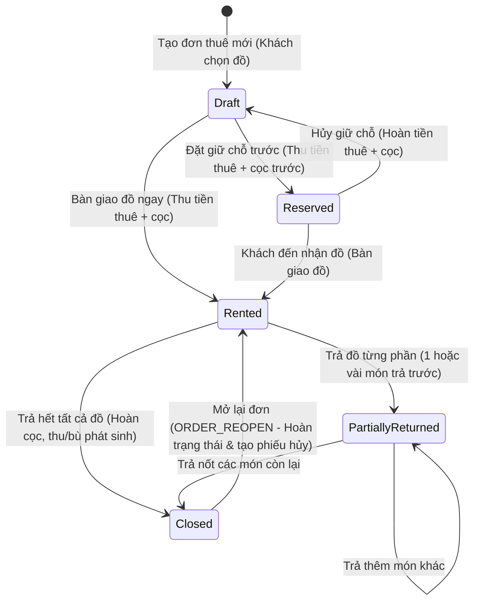

# TÀI LIỆU ĐẶC TẢ YÊU CẦU PHẦN MỀM (SRS)
## HỆ THỐNG QUẢN LÝ THUÊ & BÁN TRANG PHỤC (CLOTHING RENTAL & SALES MANAGEMENT SYSTEM)

> **Mục đích tài liệu:** Tài liệu này đặc tả toàn bộ nghiệp vụ, luồng quy trình, công thức tính toán, phân quyền và các tính năng của hệ thống Quản lý Thuê & Bán Trang phục. Tài liệu được thiết kế làm tiêu chuẩn kỹ thuật đầy đủ để AI Agent hoặc Đội ngũ Kỹ sư phần mềm có thể tái xây dựng (rebuild) lại 100% ứng dụng trên bất kỳ nền tảng công nghệ nào (ví dụ: Next.js / NestJS, Laravel, Python FastAPI / Django, Golang, Spring Boot, v.v.) mà không bị thiếu sót bất kỳ logic nào.

---

## MỤC LỤC
1. [TỔNG QUAN HỆ THỐNG & KIẾN TRÚC](#1-tổng-quan-hệ-thống--kiến-trúc)
2. [TÁC NHÂN & MA TRẬN PHÂN QUYỀN (RBAC)](#2-tác-nhân--ma-trận-phân-quyền-rbac)
3. [QUẢN LÝ HÀNG HÓA & KHO BÃI (INVENTORY MODULE)](#3-quản-lý-hàng-hóa--kho-bãi-inventory-module)
4. [QUY TRÌNH ĐƠN HÀNG THUÊ TRANG PHỤC (RENTAL ORDER WORKFLOW)](#4-quy-trình-đơn-hàng-thuê-trang-phục-rental-order-workflow)
5. [QUY TRÌNH ĐƠN XUẤT BÁN ĐỨT (RETAIL SALES WORKFLOW)](#5-quy-trình-đơn-xuất-bán-đứt-retail-sales-workflow)
6. [QUY TRÌNH THANH LÝ SẢN PHẨM (LIQUIDATION WORKFLOW)](#6-quy-trình-thanh-lý-sản-phẩm-liquidation-workflow)
7. [HỆ THỐNG KHUYẾN MÃI & VOUCHER (PROMOTION MODULE)](#7-hệ-thống-khuyến-mãi--voucher-promotion-module)
8. [QUẢN LÝ KHÁCH HÀNG & CCCD (CRM MODULE)](#8-quản-lý-khách-hàng--cccd-crm-module)
9. [HỆ THỐNG GIAO DỊCH & DÒNG TIỀN (FINANCIAL TRANSACTIONS)](#9-hệ-thống-giao-dịch--dòng-tiền-financial-transactions)
10. [MÀN HÌNH KHÁCH HÀNG & TÍCH HỢP VIETQR (DUAL-SCREEN POS)](#10-màn-hình-khách-hàng--tích-hợp-vietqr-dual-screen-pos)
11. [DỊCH VỤ IN ẤN NHÃN & HÓA ĐƠN TỰ ĐỘNG (PRINT AGENT)](#11-dịch-vụ-in-ấn-nhãn--hóa-đơn-tự-động-print-agent)
12. [HỆ THỐNG BÁO CÁO THỐNG KÊ (REPORTING MODULE)](#12-hệ-thống-báo-cáo-thống-kê-reporting-module)
13. [CẤU HÌNH HỆ THỐNG & TELEGRAM BOT NOTIFICATION](#13-cấu-hình-hệ-thống--telegram-bot-notification)

---

## 1. TỔNG QUAN HỆ THỐNG & KIẾN TRÚC

### 1.1. Phạm vi nghiệp vụ
Hệ thống giải quyết toàn diện bài toán kinh doanh của các cửa hàng cho thuê trang phục (váy cưới, veston, áo dài, trang phục dạ hội, cosplay, đạo cụ biểu diễn) kết hợp bán lẻ phụ kiện/sản phẩm may mặc:
* Quản lý vòng đời trang phục từ lúc nhập kho, cho thuê nhiều lần, sửa chữa, đến khi thanh lý thu hồi vốn.
* Theo dõi tình trạng cọc (tiền mặt / chuyển khoản / giữ giấy tờ CCCD).
* Tự động hóa tính phí thuê, phí trễ hạn (overdue), phí phụ thu hỏng hóc/bẩn đồ (damage penalty).
* Khả năng kiểm tra xung đột lịch thuê (overlapping date reservation) tránh cho thuê trùng món đồ cùng thời điểm.
* Điểm bán hàng POS với màn hình kép (Dual Display) hướng về phía khách hàng, hỗ trợ mã QR động VietQR và phát giọng nói cảm ơn.
* In hóa đơn nhiệt (80mm/58mm) và nhãn mã vạch (Barcode label) trực tiếp không qua hộp thoại trình duyệt.

### 1.2. Các thực thể chính (Core Entities)
* **User & RoleGroup:** Tài khoản nhân viên, nhóm quyền, phân quyền chi tiết.
* **Category & PriceList:** Danh mục loại hàng (sinh tiền tố mã) và bảng giá chuẩn (giá thuê 1 ngày, tiền cọc, phụ kiện tặng kèm).
* **Product & ProductAttribute:** Trang phục/đạo cụ với mã vạch duy nhất, số lượng thực tế trong kho, số lượng đang cho thuê, thuộc tính động (size, màu, chất liệu, độ mới).
* **Customer:** Hồ sơ khách hàng, số điện thoại định danh, lịch sử thuê, lưu vết CCCD.
* **Order & OrderDetail:** Hợp đồng thuê đồ, ngày thuê, hạn trả, ngày trả thực tế, các khoản cọc, tiền thuê, phát sinh phạt, trạng thái từng món đồ.
* **SaleOrder & SaleOrderDetail:** Đơn xuất bán đứt trang phục / phụ kiện.
* **LiquidationOrder & LiquidationOrderDetail:** Đơn thanh lý loại bỏ đồ hỏng/cũ khỏi kho.
* **Transaction:** Sổ quỹ ghi nhận mọi dòng tiền thu/chi (thu cọc, thu tiền thuê, thu phạt, hoàn cọc, hoàn tiền, thanh toán đơn bán).
* **Voucher:** Mã giảm giá cố định (Fixed) hoặc phần trăm (Percent) kèm điều kiện đơn tối thiểu và giới hạn giảm tối đa.

---

## 2. TÁC NHÂN & MA TRẬN PHÂN QUYỀN (RBAC)

### 2.1. Nhóm người dùng (User Roles)
1. **Super Admin (Quản trị viên tối cao):**
   * Bỏ qua tất cả các tầng kiểm tra quyền (`IsAdmin == true`).
   * Được thực hiện mọi nghiệp vụ: cấu hình hệ thống, mở lại đơn đã đóng (`ORDER_REOPEN`), hủy giao dịch của người khác (`TRANSACTION_CANCEL_ANY`), quản lý người dùng, nhóm quyền và menu.
2. **Quản lý cửa hàng (Store Manager):**
   * Quản lý toàn bộ danh mục, bảng giá, duyệt thanh lý, xem toàn bộ báo cáo doanh thu và giao dịch.
3. **Nhân viên Thu ngân & Bán hàng (Cashier / Sales):**
   * Tạo đơn thuê, đặt giữ chỗ, bàn giao đồ, trả đồ, áp mã voucher, tạo đơn xuất bán, xem tồn kho.
   * Chỉ được xem giao dịch do chính mình thực hiện trong báo cáo giao dịch cá nhân.
4. **Thủ kho (Warehouse / Inventory Keeper):**
   * Nhập hàng mới, nhập hàng loạt bằng Excel, in mã vạch sản phẩm, cập nhật thuộc tính động, tạo phiếu thanh lý hàng hỏng.
5. **Kế toán (Accountant):**
   * Theo dõi toàn bộ báo cáo doanh thu, sổ quỹ giao dịch tiền mặt/chuyển khoản, danh sách giữ CCCD, đơn đã đóng / chưa đóng.

### 2.2. Danh sách Mã quyền (Permissions Matrix)

| Nhóm chức năng | Mã quyền (Code) | Tên hiển thị | Loại (Type) | Mô tả chi tiết |
| :--- | :--- | :--- | :--- | :--- |
| **Báo cáo** | `REPORT_VIEW` | Xem Báo cáo | UI | Truy cập trang tổng quan báo cáo |
| | `REPORT_TRANSACTIONS` | Báo cáo Giao dịch | UI | Xem sổ quỹ, thống kê dòng tiền thu/chi |
| | `REPORT_CLOSED_ORDERS` | Báo cáo Đơn đã đóng | UI | Thống kê doanh thu từ đơn thuê hoàn tất |
| | `REPORT_OPEN_ORDERS` | Báo cáo Đơn đang mở | UI | Thống kê tiền thuê & cọc đang giữ |
| | `REPORT_PRODUCT_SALES` | Doanh thu mặt hàng bán | UI | Báo cáo hiệu suất bán lẻ từng sản phẩm |
| | `REPORT_ID_CARDS` | Báo cáo Nhận CCCD | UI | Danh sách đơn hàng đang giữ CCCD khách |
| | `REPORT_STAFF_REVENUE` | Doanh thu nhân viên | UI | Doanh số bán & thuê theo từng nhân viên |
| | `REPORT_LOW_STOCK` | Cảnh báo tồn kho | UI | Danh sách sản phẩm dưới định mức tồn |
| **Sản phẩm** | `CLOTHES_VIEW` | Xem sản phẩm | UI | Xem danh mục sản phẩm trong kho |
| | `CLOTHES_CREATE` | Thêm sản phẩm | Action | Tạo sản phẩm mới, nhập từ Excel |
| | `CLOTHES_EDIT` | Sửa sản phẩm | Action | Chỉnh sửa thông tin, giá nhập, ảnh |
| | `CLOTHES_LOCK` | Khóa sản phẩm | Action | Tạm ngưng/mở khóa sản phẩm |
| | `CLOTHES_DELETE` | Xóa sản phẩm | Action | Xóa sản phẩm (chưa phát sinh đơn thuê) |
| | `CLOTHES_IMPORT_HISTORY`| Xem lịch sử nhập hàng| UI | Xem log biến động kho hàng (`StockHistory`) |
| **Loại hàng** | `CATEGORY_VIEW` | Xem loại hàng | UI | Xem danh sách loại mặt hàng |
| | `CATEGORY_CREATE` | Thêm loại hàng | Action | Tạo loại hàng (tiền tố mã hàng) |
| | `CATEGORY_EDIT` | Sửa loại hàng | Action | Sửa tên, mô tả loại hàng |
| | `CATEGORY_LOCK` | Khóa loại hàng | Action | Bật/tắt trạng thái sử dụng loại hàng |
| **Thuộc tính** | `PRODUCT_ATTRIBUTE_VIEW` | Xem thuộc tính | UI | Xem danh sách thuộc tính động |
| | `PRODUCT_ATTRIBUTE_CREATE`| Thêm thuộc tính | Action | Tạo thuộc tính động mới |
| | `PRODUCT_ATTRIBUTE_EDIT` | Sửa thuộc tính | Action | Sửa nhãn hiển thị thuộc tính |
| | `PRODUCT_ATTRIBUTE_LOCK` | Khóa thuộc tính | Action | Khóa thuộc tính không cho chọn |
| **Bảng giá** | `PRICELIST_VIEW` | Xem loại giá | UI | Xem danh sách bảng giá thuê |
| | `PRICELIST_CREATE` | Thêm loại giá | Action | Tạo bảng giá (giá/ngày, cọc, quà tặng) |
| | `PRICELIST_EDIT` | Sửa loại giá | Action | Chỉnh sửa giá thuê, tiền cọc |
| | `PRICELIST_LOCK` | Khóa loại giá | Action | Tạm ngưng bảng giá |
| | `PRICELIST_DELETE` | Xóa loại giá | Action | Xóa bảng giá chưa gán sản phẩm |
| **Đơn hàng** | `ORDER_VIEW` | Xem Đơn hàng | UI | Xem danh sách đơn thuê & đơn bán |
| | `ORDER_CREATE` | Tạo Đơn thuê | Action | Lập đơn thuê trang phục |
| | `SALE_CREATE` | Tạo Đơn mua (Bán đứt) | Action | Lập đơn bán đứt sản phẩm |
| | `ORDER_DETAIL` | Xem Chi tiết Đơn | UI | Xem chi tiết hợp đồng & dòng tiền đơn |
| | `ORDER_CONFIRM` | Xác nhận đơn | Action | Thu tiền/cọc, chuyển Draft -> Rented/Reserved |
| | `ORDER_RETURN` | Trả hàng & Phát sinh | Action | Nhận lại đồ, ghi nhận phạt, gia hạn |
| | `ORDER_CLOSE` | Đóng đơn | Action | Hoàn tất đơn, hoàn cọc cho khách |
| | `ORDER_REOPEN` | Mở lại đơn đã đóng | Action | Mở lại đơn Closed -> Rented / Draft |
| | `TRANSACTION_CANCEL` | Hủy phiếu thu của mình | Action | Hủy phiếu thu do chính mình tạo |
| | `TRANSACTION_CANCEL_ANY` | Hủy phiếu thu bất kỳ | Action | Hủy phiếu thu do nhân viên khác tạo (Admin) |
| **Thanh lý** | `CLOTHES_LIQUIDATE_VIEW` | Xem lịch sử thanh lý | UI | Xem danh sách phiếu thanh lý |
| | `CLOTHES_LIQUIDATE_CREATE`| Thực hiện thanh lý | Action | Tạo phiếu xuất thanh lý trừ kho |
| | `CLOTHES_LIQUIDATE_CANCEL`| Hủy phiếu thanh lý | Action | Hủy thanh lý và hoàn trả tồn kho |
| **Voucher** | `VOUCHER_VIEW` | Xem Voucher | UI | Xem danh sách mã giảm giá |
| | `VOUCHER_CREATE` | Thêm Voucher | Action | Tạo mã giảm giá mới |
| | `VOUCHER_EDIT` | Sửa Voucher | Action | Chỉnh sửa mã giảm giá |
| | `VOUCHER_DELETE` | Xóa Voucher | Action | Xóa mã giảm giá |
| **Hệ thống** | `USER_MANAGEMENT_VIEW` | Quản lý người dùng | UI | Xem, tạo, sửa quyền tài khoản |
| | `ROLE_GROUP_VIEW` | Xem Nhóm quyền | UI | Xem danh sách vai trò mẫu |
| | `ROLE_GROUP_CREATE` | Thêm Nhóm quyền | Action | Tạo nhóm vai trò mới |
| | `ROLE_GROUP_EDIT` | Sửa Nhóm quyền | Action | Phân quyền cho nhóm vai trò |
| | `ROLE_GROUP_DELETE` | Xóa Nhóm quyền | Action | Xóa nhóm vai trò |
| | `SYSTEM_SETTINGS_VIEW`| Cài đặt Hệ thống | UI | Cấu hình VietQR, in ấn, Telegram |

### 2.3. Quy tắc kế thừa & Phân quyền Menu động
* Bảng `Menus` lưu trữ cây menu Sidebar (`ParentId`, `DisplayOrder`, `RequiredPermissionId`).
* Người dùng chỉ thấy các Menu cha và con nếu tài khoản của họ (hoặc Nhóm quyền `RoleGroup` của họ) sở hữu quyền `RequiredPermissionId` tương ứng.
* Nếu tài khoản là `Admin`, hệ thống tự động hiển thị 100% menu bất kể bảng quyền.

---

## 3. QUẢN LÝ HÀNG HÓA & KHO BÃI (INVENTORY MODULE)

### 3.1. Cấu trúc Danh mục loại hàng (Categories)
* Mỗi loại hàng quy định một **Tiếp đầu ngữ mã hàng (`CodePrefix`)** (ví dụ: Váy cưới = `VC`, Vest nam = `VS`, Áo dài = `AD`, Phụ kiện = `PK`).
* Quản lý thêm/sửa/xóa và trạng thái `IsActive`.
* Ghi log thao tác vào trường JSONB `SystemLog`.

### 3.2. Cấu trúc Bảng giá chuẩn (PriceLists)
* **Tên loại giá:** Ví dụ: "Váy VIP", "Váy Thường", "Vest Cao Cấp", "50K", "100K".
* **Đơn giá thuê 1 ngày (`PricePerDay`):** Mức giá thuê cơ sở cho 1 chu kỳ ngày.
* **Tiền cọc mặc định (`Deposit`):** Số tiền cọc quy định (thường bằng 2 - 3 lần giá thuê).
* **Phụ kiện tặng kèm (`GiftProductsJson`):** Danh sách ID các sản phẩm phụ kiện (ví dụ: hoa cưới, lúp đội đầu, cravat, nơ) tự động kèm theo miễn phí khi khách thuê sản phẩm thuộc bảng giá này:
  ```json
  [{"productId": 102, "quantity": 1}, {"productId": 105, "quantity": 1}]
  ```

### 3.3. Quy tắc sinh Mã sản phẩm (Barcode Code Generation)
Mã sản phẩm được sinh tự động theo quy tắc:
$$\text{ProductCode} = \text{Category.CodePrefix} + \text{STT (4 chữ số tự tăng)}$$
* *Ví dụ:* `VC0001`, `VC0002`, `AD0015`.
* Thuật toán: Tìm giá trị số lớn nhất trong tất cả mã hàng hiện có khớp tiền tố, tăng thêm 1 và format `D4`.

### 3.4. Vòng đời số lượng kho (Stock Lifecycle)
Đối với mỗi sản phẩm:
* `StockQuantity`: Tổng số lượng sản phẩm vật lý thuộc sở hữu của cửa hàng.
* `RentedQuantity`: Số lượng chiếc hiện đang được khách giữ ngoài cửa hàng (thuộc các đơn có trạng thái `Rented` hoặc `PartiallyReturned`).
* **Số lượng khả dụng tại cửa hàng ngay lúc này:**
  $$\text{AvailablePhysically} = \text{StockQuantity} - \text{RentedQuantity}$$
* **Số lượng khả dụng cho lịch thuê tương lai $[RentDate, DueDate]$:**
  Hệ thống đếm số lượng chiếc đã được giữ chỗ trong các đơn hàng khác trùng lịch:
  $$\text{OverlappingCount} = \sum_{\substack{\text{Orders } o \neq o_{cur} \\ o.Status \in \{\text{Reserved, Rented, PartiallyReturned}\} \\ o.RentDate \le DueDate \land o.DueDate \ge RentDate}} \text{QuantityInOrder}(p)$$
  $$\text{AvailableForBooking} = \text{StockQuantity} - \text{OverlappingCount}$$
  Nếu $\text{AvailableForBooking} < \text{RequestedQty}$, hệ thống từ chối thêm món vào đơn.

### 3.5. Thuộc tính động (Dynamic Attributes)
Hỗ trợ mở rộng thông tin trang phục linh hoạt không cần sửa DB schema qua trường JSONB `DynamicAttributes`:
```json
[
  {"key": "size", "display": "Kích cỡ", "value": "L"},
  {"key": "color", "display": "Màu sắc", "value": "Trắng ngà"},
  {"key": "material", "display": "Chất liệu", "value": "Lụa tơ tằm"},
  {"key": "condition", "display": "Tình trạng", "value": "Mới 95%"}
]
```

### 3.6. Nhập hàng loạt bằng Excel (MiniExcel)
Hệ thống hỗ trợ tải lên file Excel 2 Sheets:
1. **Sheet 1 (Danh mục):** Đọc `Mã loại hàng`, `Tên loại hàng`, `Loại giá`. Nếu chưa có trong DB, tự động khởi tạo Category & PriceList tương ứng.
2. **Sheet 2 (Hàng hóa):** Đọc `Mã hàng`, `Tên hàng`, `Mã loại hàng`, `Giá nhập`, `Giá cho thuê`, `Số lượng`, `Cảnh báo tồn kho`.
   * Tự động phân tích giá tiền dạng chuỗi: `"50k" -> 50000`, `"1.200.000" -> 1200000`.
   * Ghi log lịch sử biến động kho `StockHistory` với `ActionType = "IMPORT"`.

---

## 4. QUY TRÌNH ĐƠN HÀNG THUÊ TRANG PHỤC (RENTAL ORDER WORKFLOW)



### 4.1. Khởi tạo Đơn thuê (Create Draft Order)
1. **Mã đơn hàng:** Sinh tự động theo công thức:
   $$\text{OrderCode} = \text{"HD"} + \text{yyMMdd} + \text{STTTrongNgay (4 chữ số)}$$
   *Ví dụ:* `HD2609040001`.
2. **Khách hàng:** Tìm kiếm nhanh theo Số điện thoại hoặc Họ tên. Nếu khách mới, nhập trực tiếp trên giao diện tạo đơn; hệ thống tự động lưu vào bảng `Customers`.
3. **Mặt hàng thuê:**
   * Quét mã vạch (Barcode Scanner) hoặc tìm theo tên.
   * Kiểm tra lịch khả dụng: Hệ thống cảnh báo ngay nếu sản phẩm đã bị trùng lịch trong khoảng $[RentDate, DueDate]$.
   * Tự động nạp danh sách quà tặng kèm (Free Accessories) từ cấu hình `PriceList.GiftProductsJson` (các dòng này có cờ `IsGift = true`, `RentPrice = 0`, `Deposit = 0`).
   * Cho phép chỉnh sửa đơn giá thuê, số ngày thuê riêng lẻ cho từng sản phẩm, tiền cọc, phụ thu (`AddAmt`) hoặc giảm trừ (`DeductAmt`).
4. **Voucher:** Nhập mã giảm giá, kiểm tra điều kiện hiệu lực và giá trị đơn tối thiểu, tính số tiền giảm `DiscountAmount`.
5. **Đính kèm:** Cho phép chụp ảnh khách mặc thử / tình trạng sản phẩm và upload lưu trữ tại `/wwwroot/uploads`.
6. **Xác nhận giữ CCCD:** Tích chọn `IsIdCardReceived = true` nếu cửa hàng giữ CCCD của khách thay thế một phần tiền cọc.

### 4.2. Các bước chuyển trạng thái nghiệp vụ

#### Bước 1: Đặt giữ chỗ trước (`Draft -> Reserved`)
* Áp dụng khi khách thử đồ ưng ý và đặt cọc/thanh toán giữ chỗ cho ngày cưới/sự kiện trong tương lai.
* Hệ thống cập nhật:
  * `Order.Status = "Reserved"`
  * `Order.DepositStatus = "Holding"`
* Ghi nhận 2 bản ghi `Transaction`:
  1. `Type = "DEPOSIT_RECEIVED"`, số tiền `TotalDeposit`.
  2. `Type = "RENTAL_PAYMENT"`, số tiền `FinalAmount` (Tiền thuê sau giảm giá).
* Lưu ý: Lúc này đồ chưa rời cửa hàng vật lý nên `Product.RentedQuantity` **chưa tăng**, nhưng lịch thuê đã bị chiếm giữ khiến đơn khác không thể đặt trùng.

#### Bước 2: Bàn giao đồ (`Reserved -> Rented` hoặc `Draft -> Rented`)
* Áp dụng khi khách lấy đồ ra khỏi cửa hàng.
* Hệ thống tăng `Product.RentedQuantity += 1` cho từng sản phẩm trong đơn.
* Kiểm tra an toàn: Đảm bảo $\text{StockQuantity} > \text{RentedQuantity}$.

#### Bước 3: Hủy đặt giữ chỗ (`Reserved -> Draft`)
* Áp dụng khi khách báo hủy lịch thuê trước ngày diễn ra sự kiện.
* Hệ thống hoàn lại trạng thái: `Order.Status = "Draft"`, `Order.DepositStatus = "None"`.
* Sinh 2 giao dịch hoàn trả đối chiếu:
  1. `Type = "DEPOSIT_RECEIVED_CANCEL"`, số tiền `TotalDeposit`.
  2. `Type = "RENTAL_PAYMENT_CANCEL"`, số tiền tiền thuê đã thu.

#### Bước 4: Trả đồ từng phần hoặc toàn bộ (`Rented / PartiallyReturned -> Closed`)
* Khi khách đem đồ đến trả, nhân viên kiểm tra từng sản phẩm trên màn hình:
  * Tích chọn sản phẩm được trả (`OrderDetail.IsReturned = true`, ghi nhận `ReturnDate = DateTime.UtcNow`).
  * Giảm `Product.RentedQuantity = Math.Max(0, RentedQuantity - 1)`.
  * Tích lũy doanh thu thuê cho sản phẩm: `Product.TotalRentRevenue += OrderDetail.RentPrice`.
  * Ghi nhận tình trạng đồ khi nhận lại (`ConditionAtReceive`): vết ố bẩn, rách tà, cháy xém, thiếu phụ kiện...
  * **Cập nhật phí phát sinh (`PenaltyFee`) & Lý do phạt (`PenaltyReason`):** Áp dụng công thức tính phạt tự động hoặc điều chỉnh bằng tay.
* **Đóng đơn hoàn tất:**
  * Khi tất cả chi tiết đơn có `IsReturned == true`:
  * `Order.Status = "Closed"`
  * `Order.ActualReturnDate = DateTime.UtcNow`
  * `Order.ClosedByUserId = CurrentUserId`
  * `Order.DepositStatus = "Refunded"`
  * Sinh giao dịch hoàn cọc: `Type = "DEPOSIT_REFUNDED"`, số tiền `TotalDeposit`.
  * Nếu có phạt phát sinh chưa thanh toán: Sinh giao dịch thu phạt `Type = "PENALTY_PAYMENT"`.

#### Bước 5: Mở lại đơn đã đóng (`Closed -> Rented` - Feature Quản trị)
* Áp dụng khi nhân viên đóng nhầm đơn hoặc khách đổi trả phát sinh sự cố sau khi đã đóng đơn.
* Yêu cầu quyền: `ORDER_REOPEN` hoặc `Admin`.
* Quy trình xử lý hoàn trả:
  1. `Order.Status = "Rented"`, `ActualReturnDate = null`, `ClosedByUserId = null`.
  2. Đặt lại tất cả chi tiết `OrderDetail.IsReturned = false`, `ReturnDate = null`.
  3. Hoàn lại tồn kho cho thuê: Tăng lại `Product.RentedQuantity += 1` và trừ lại `TotalRentRevenue`.
  4. Hủy các giao dịch ở giai đoạn đóng đơn bằng cách sinh giao dịch đối xứng:
     * `DEPOSIT_REFUNDED_CANCEL` (hủy hoàn cọc để tiếp tục giữ cọc).
     * `PENALTY_PAYMENT_CANCEL` (hủy tiền phạt đã chốt).
     * `RENTAL_REFUND_CANCEL` (hủy hoàn tiền thuê nếu có).

---

### 4.3. Công thức tính tiền thuê, ngày trễ hạn & Phí phạt

#### A. Công thức tính tiền thuê gốc
$$\text{BaseRentPrice} = \sum (\text{PricePerDay} \times \text{RentDays} + \text{AddAmt} - \text{DeductAmt})$$
$$\text{FinalAmount} = \text{TotalPrice} - \text{DiscountAmount} + \text{TotalPenalty}$$

#### B. Quy tắc tính số ngày trễ hạn (Grace Period Rule)
* Cửa hàng áp dụng chính sách ưu đãi hạn trả: Khách thuê $N$ ngày thì được miễn phí thêm 1 ngày ân hạn (trả trong ngày tiếp theo không tính thêm tiền):
  $$\text{GracePeriodEndDate} = \text{RentDate.Date} + (N + 1) \text{ ngày}$$
* Số ngày trễ hạn thực tế:
  $$\text{LateDays} = \begin{cases} 0 & \text{nếu } \text{ActualReturnDate.Date} \le \text{GracePeriodEndDate} \\ (\text{ActualReturnDate.Date} - \text{GracePeriodEndDate}).\text{Days} & \text{nếu } \text{ActualReturnDate.Date} > \text{GracePeriodEndDate} \end{cases}$$

#### C. Công thức tính tiền phạt trễ hạn tự động
Quy chuẩn cấu hình hệ thống:
* Đơn giá phạt trễ mỗi ngày: $\text{DailyLateFee} = 10,000 \text{ VND/ngày}$ (cấu hình trong `Rental_LateFeePerDay`).
* Ngưỡng lặp chu kỳ giá gốc: $\text{ThresholdDays} = 4 \text{ ngày}$ (cấu hình trong `Rental_LateDayThreshold`).

Công thức tính phạt cho từng sản phẩm:
$$\text{PenaltyFee} = (\text{LateDays} \times \text{DailyLateFee}) + \begin{cases} \text{BasePricePerDay} & \text{nếu } \text{LateDays} \ge \text{ThresholdDays} \\ 0 & \text{ngược lại} \end{cases}$$

*Ví dụ:* Khách thuê chiếc váy giá 100,000đ/ngày trong 1 ngày vào ngày 01/09:
* Hạn ân hạn miễn phí: Ngày 01/09 + (1 + 1) = Hết ngày 03/09.
* Trả ngày 03/09: LateDays = 0 $\rightarrow$ Phạt = 0đ.
* Trả ngày 05/09: Trễ 2 ngày $\rightarrow$ Phạt = $2 \times 10,000 = 20,000$đ.
* Trả ngày 08/09: Trễ 5 ngày ($\ge 4$ ngày) $\rightarrow$ Phạt = $(5 \times 10,000) + 100,000 = 150,000$đ.

---

## 5. QUY TRÌNH ĐƠN XUẤT BÁN ĐỨT (RETAIL SALES WORKFLOW)

Dành cho các giao dịch bán lẻ trang phục mới, bán đứt phụ kiện (giày, vớ, phụ kiện tóc, hoa cầm tay) thay vì cho thuê.

### 5.1. Khởi tạo Đơn bán (`Pages/Orders/SaleCreate`)
1. **Mã đơn bán:** Sinh tự động theo công thức:
   $$\text{SaleOrderCode} = \text{"MD"} + \text{yyMMdd} + \text{STTTrongNgay (4 chữ số)}$$
   *Ví dụ:* `MD2609040001`.
2. **Khách hàng:** Chọn khách hàng cũ hoặc thêm nhanh khách mới theo SĐT.
3. **Chọn sản phẩm bán:**
   * Cho phép chọn các sản phẩm có tồn kho vật lý khả dụng: $\text{StockQuantity} - \text{RentedQuantity} > 0$.
   * Nhập số lượng xuất bán (`Quantity`) và đơn giá bán thỏa thuận (`Price`).
4. **Áp mã giảm giá Voucher:** Kiểm tra hạn mức và trừ tiền chiết khấu `DiscountAmount`.
5. **Lưu nháp (`Status = "Draft"`):** Chưa trừ tồn kho, chưa thu tiền.

### 5.2. Xác nhận đơn bán (`Draft -> Closed`)
* Thực hiện bởi thu ngân tại trang chi tiết `SaleDetail`:
  1. Kiểm tra tồn kho lần cuối: Đảm bảo tồn kho đủ cho số lượng xuất bán.
  2. **Trừ số lượng tồn kho vật lý:**
     $$\text{Product.StockQuantity} = \text{Product.StockQuantity} - \text{detail.Quantity}$$
  3. **Ghi sổ biến động kho `StockHistory`:**
     * `ActionType = "SALE"`
     * `QuantityChange = -detail.Quantity`
     * `Note = "Xuất kho bán hàng trực tiếp (Đơn mua MD...)"`
  4. **Ghi nhận giao dịch tài chính:**
     * Bảng `Transactions`: `Type = "SALE_PAYMENT"`, `Amount = FinalAmount`, `SaleOrderId = order.Id`, `PaymentMethod = CASH / TRANSFER`.
  5. Đổi trạng thái `SaleOrder.Status = "Closed"`.
  6. Tự động kích hoạt in hóa đơn bán hàng qua Print Agent và phát giọng nói cảm ơn trên Customer Display.

### 5.3. Mở lại đơn bán (`Closed -> Draft`)
* Trường hợp khách đổi ý trả lại hàng mua:
  1. Yêu cầu quyền `ORDER_REOPEN` hoặc `Admin`.
  2. Hoàn lại số lượng tồn kho vật lý: `Product.StockQuantity += detail.Quantity`.
  3. Ghi log `StockHistory` với `ActionType = "IMPORT"`, `QuantityChange = +detail.Quantity`.
  4. Sinh giao dịch đối chiếu hủy doanh thu: `Type = "SALE_PAYMENT_CANCEL"`.
  5. Chuyển trạng thái `SaleOrder.Status = "Draft"`.

---

## 6. QUY TRÌNH THANH LÝ SẢN PHẨM (LIQUIDATION WORKFLOW)

Dành cho các trang phục đã cho thuê nhiều lần bị sờn rách, ố màu không thể phục hồi, lỗi mốt hoặc đạo cụ hỏng cần loại bỏ khỏi kho tài sản.

### 6.1. Đánh giá hiệu quả đầu tư trước khi thanh lý (ROI Analysis)
Trên giao diện tạo đơn thanh lý (`LiquidateCreate`), hệ thống trực quan hóa 2 chỉ số cực kỳ quan trọng cho chủ shop:
* **Giá nhập (`ImportPrice`):** Chi phí ban đầu bỏ ra mua trang phục.
* **Tổng tiền cho thuê tích lũy (`TotalRentRevenue`):** Tổng doanh thu mà trang phục này đã kiếm về qua các lần cho thuê trong quá khứ.
$$\text{Lợi nhuận gộp từ sản phẩm} = \text{TotalRentRevenue} - \text{ImportPrice}$$
Giúp chủ shop đưa ra quyết định thanh lý chính xác (sản phẩm đã hòa vốn hay lỗ).

### 6.2. Tạo phiếu thanh lý (`LiquidateCreate`)
1. **Mã phiếu thanh lý:** Sinh tự động:
   $$\text{LiquidationCode} = \text{"TL"} + \text{yyMMdd} + \text{STT (4 chữ số)}$$
2. **Chọn sản phẩm thanh lý:** Chọn số lượng cần loại bỏ (`Quantity`) và ghi rõ lý do (hỏng khóa, rách vải, ố màu...).
3. **Cập nhật kho:**
   * Trừ trực tiếp `Product.StockQuantity -= Quantity`.
   * Nếu `Product.StockQuantity == 0`: Tự động đánh dấu `Product.IsLiquidated = true` và `Product.IsAvailable = false`.
   * Ghi log `StockHistory`: `ActionType = "LIQUIDATE"`, `QuantityChange = -Quantity`.
4. Trạng thái phiếu: `Completed`.

---

## 7. HỆ THỐNG KHUYẾN MÃI & VOUCHER (PROMOTION MODULE)

### 7.1. Cấu hình Voucher
* **Mã Voucher (`Code`):** Viết hoa duy nhất (VD: `SUMMER50`, `VIP10`).
* **Loại chiết khấu (`DiscountType`):**
  * `FIXED`: Giảm số tiền cố định (VD: 50,000đ).
  * `PERCENT`: Giảm theo tỷ lệ phần trăm (VD: 10%).
* **Giá trị giảm (`DiscountValue`):** Số tiền hoặc số %.
* **Giới hạn giảm tối đa (`MaxDiscountAmount`):** Áp dụng cho loại `PERCENT` để tránh giảm vượt quá ngân sách (VD: Giảm 20% tối đa 100,000đ).
* **Giá trị đơn hàng tối thiểu (`MinOrderAmount`):** Điều kiện kích hoạt voucher (VD: Đơn thuê từ 300,000đ trở lên).
* **Giới hạn số lượt dùng (`MaxUsageCount`) & Số lượt đã dùng (`UsedCount`):** Tự động khóa khi đạt ngưỡng.
* **Khoảng thời gian hiệu lực:** `StartDate` đến `EndDate`.

### 7.2. Thuật toán áp dụng và kiểm tra Voucher
```text
IF (Voucher.IsActive == false) -> Lỗi: "Mã giảm giá đã bị khóa"
IF (CurrentTime < StartDate OR CurrentTime > EndDate) -> Lỗi: "Mã giảm giá hết hạn"
IF (MaxUsageCount != null AND UsedCount >= MaxUsageCount) -> Lỗi: "Mã giảm giá hết lượt sử dụng"
IF (OrderRentTotal < MinOrderAmount) -> Lỗi: "Đơn hàng chưa đạt giá trị tối thiểu"

IF (DiscountType == "FIXED") THEN
    DiscountAmount = DiscountValue
ELSE IF (DiscountType == "PERCENT") THEN
    DiscountAmount = OrderRentTotal * (DiscountValue / 100)
    IF (MaxDiscountAmount != null AND DiscountAmount > MaxDiscountAmount) THEN
        DiscountAmount = MaxDiscountAmount
    END IF
END IF

DiscountAmount = Min(DiscountAmount, OrderRentTotal) // Không giảm âm tiền đơn
```

---

## 8. QUẢN LÝ KHÁCH HÀNG & CCCD (CRM MODULE)

### 8.1. Thông tin khách hàng
* Số điện thoại (`PhoneNumber`) là **Khóa định danh tìm kiếm duy nhất** (Unique Index).
* Thông tin: Họ tên, CCCD/CMND (`IdentityCard`), Địa chỉ, Trạng thái (`Active` hoặc `Blacklisted`), Ghi chú vi phạm.

### 8.2. Nghiệp vụ theo dõi lưu giữ CCCD (`IdCards Report`)
* Khách thuê trang phục giá trị cao thường không có đủ tiền mặt đặt cọc. Cửa hàng cho phép khách để lại Căn cước công dân (CCCD) làm tin.
* Hệ thống có trang quản lý riêng `/Reports/IdCards`:
  * Liệt kê tất cả các đơn hàng đang giữ CCCD của khách (`IsIdCardReceived == true` hoặc khách có số CCCD lưu trong hệ thống).
  * Hiển thị trạng thái đơn (đang thuê hay đã trả) để nhân viên nhắc khách nhận lại giấy tờ khi thanh lý hợp đồng.

---

## 9. HỆ THỐNG GIAO DỊCH & DÒNG TIỀN (FINANCIAL TRANSACTIONS)

Mọi dòng tiền ra vào cửa hàng đều được quản lý chặt chẽ trong bảng `Transactions` theo nguyên tắc kế toán kép / đối chiếu hủy.

### 9.1. Các loại giao dịch (Transaction Types)

| Nhóm dòng tiền | Loại giao dịch (`Type`) | Ý nghĩa nghiệp vụ | Chiều dòng tiền |
| :--- | :--- | :--- | :--- |
| **Dòng Thu (Inflows)** | `DEPOSIT_RECEIVED` | Thu tiền cọc khi xác nhận đơn hoặc giữ chỗ | **+ Thu (Income)** |
| | `RENTAL_PAYMENT` | Thu tiền thuê đồ | **+ Thu (Income)** |
| | `PENALTY_PAYMENT` | Thu tiền phạt trễ hạn hoặc hỏng hóc | **+ Thu (Income)** |
| | `SALE_PAYMENT` | Thu tiền bán lẻ sản phẩm đứt | **+ Thu (Income)** |
| | `DEPOSIT_REFUNDED_CANCEL` | Hủy hoàn cọc (khi mở lại đơn đã đóng) | **+ Thu (Income)** |
| | `RENTAL_REFUND_CANCEL` | Hủy phiếu hoàn tiền thuê | **+ Thu (Income)** |
| **Dòng Chi (Outflows)**| `DEPOSIT_REFUNDED` | Hoàn trả cọc lại cho khách khi trả đủ đồ | **- Chi (Expense)** |
| | `RENTAL_REFUND` | Hoàn lại tiền thuê (do khách trả sớm/khiếu nại) | **- Chi (Expense)** |
| | `DEPOSIT_RECEIVED_CANCEL`| Hủy phiếu thu cọc (khi hủy đơn đặt chỗ) | **- Chi (Expense)** |
| | `RENTAL_PAYMENT_CANCEL` | Hủy phiếu thu tiền thuê (khi hủy đơn giữ chỗ) | **- Chi (Expense)** |
| | `PENALTY_PAYMENT_CANCEL` | Hủy phiếu thu phạt phát sinh | **- Chi (Expense)** |
| | `SALE_PAYMENT_CANCEL` | Hủy phiếu thu tiền bán (khi mở lại đơn bán) | **- Chi (Expense)** |

### 9.2. Phương thức thanh toán
* `CASH`: Tiền mặt tại quầy thu ngân.
* `TRANSFER`: Chuyển khoản ngân hàng (quét mã VietQR).

### 9.3. Công thức tính toán Sổ quỹ
$$\text{Tổng Thu (TotalIncome)} = \sum \text{Amount của các giao dịch Dòng Thu}$$
$$\text{Tổng Chi (TotalExpense)} = \sum \text{Amount của các giao dịch Dòng Chi}$$
$$\text{Doanh thu thực tế (NetRevenue)} = \text{TotalIncome} - \text{TotalExpense}$$
$$\text{Tồn quỹ Tiền mặt} = \text{CashIncome} - \text{CashExpense}$$
$$\text{Tồn quỹ Chuyển khoản} = \text{TransferIncome} - \text{TransferExpense}$$

### 9.4. Quy tắc an toàn khi hủy phiếu thu (`Transaction Cancellation`)
* Giao dịch mang hậu tố `_CANCEL` không thể bị hủy tiếp lần 2.
* Nhân viên bình thường chỉ có quyền hủy phiếu thu do chính mình tạo ra (`t.PerformedBy == CurrentUser`).
* Chỉ tài khoản có quyền `TRANSACTION_CANCEL_ANY` hoặc `Admin` mới được hủy phiếu thu của nhân viên khác.

---

## 10. MÀN HÌNH KHÁCH HÀNG & TÍCH HỢP VIETQR (DUAL-SCREEN POS)

Hệ thống hỗ trợ tính năng màn hình thứ hai (Customer Display) dành riêng cho các quầy thu ngân có 2 màn hình:
* Màn hình 1 (Chính): Nhân viên thao tác lên đơn, quét mã vạch.
* Màn hình 2 (Phụ hướng về phía khách): Chạy tại đường dẫn `/Orders/CustomerDisplay`.

### 10.1. Cơ chế đồng bộ không độ trễ (Real-time BroadcastChannel)
* Màn hình nhân viên và màn hình khách hàng kết nối trực tiếp qua API trình duyệt:
  ```javascript
  const channel = new BroadcastChannel('vietqr_payment_display');
  ```
* Không phụ thuộc vào kết nối mạng Internet hay WebSocket Server bên ngoài, độ trễ 0ms.
* Các sự kiện truyền tải qua kênh:
  1. `UPDATE_ITEMS`: Danh sách sản phẩm vừa quét mã vạch, số lượng, tiền cọc, tiền thuê, mã voucher, tổng thanh toán.
  2. `SHOW_QR`: Hiển thị mã VietQR động để khách thanh toán.
  3. `PAYMENT_SUCCESS`: Chuyển màn hình cảm ơn và kích hoạt giọng nói đọc số tiền.
  4. `RESET`: Đưa màn hình về trạng thái chờ (Welcome screen).

### 10.2. Tích hợp thanh toán VietQR động
* Hệ thống hỗ trợ tách riêng 2 tài khoản ngân hàng để hạch toán độc lập dòng tiền:
  * **Tài khoản Thu tiền thuê:** Cấu hình `VietQR_RentBankBin`, `VietQR_RentAccountNumber`, `VietQR_RentAccountName`.
  * **Tài khoản Thu tiền cọc:** Cấu hình `VietQR_DepositBankBin`, `VietQR_DepositAccountNumber`, `VietQR_DepositAccountName`.
* Cú pháp sinh URL ảnh mã QR chuẩn Napas VietQR:
  $$\text{https://img.vietqr.io/image/\{BankBin\}-\{AccountNumber\}-compact2.png?amount=\{Amount\}\&addInfo=\{OrderCode\}\&accountName=\{AccountName\}}$$
* Màn hình hiển thị song song 2 mã QR nếu đơn có cả tiền thuê và tiền cọc chuyển khoản, giúp khách chuyển đúng tài khoản.

### 10.3. Text-To-Speech (Phát giọng nói thông báo)
* Khi đơn hàng hoàn tất hoặc thanh toán thành công, hệ thống sử dụng Web Speech Synthesis API để phát loa thông báo tại quầy:
  > *"Giao dịch thành công, cảm ơn quý khách."* (Nội dung cấu hình tại `VietQR_SuccessSpeech`).

---

## 11. DỊCH VỤ IN ẤN NHÃN & HÓA ĐƠN TỰ ĐỘNG (PRINT AGENT)

Để tránh hộp thoại xác nhận in (Print Dialog) phiền toái của trình duyệt trên máy POS, hệ thống tích hợp ứng dụng ngầm `ClothingRentalPrintAgent`.

### 11.1. Kiến trúc Print Agent
* Là ứng dụng chạy trên khay hệ thống (System Tray) của máy Windows kết nối trực tiếp với máy in nhiệt qua cổng USB/LAN.
* Lắng nghe cổng HTTP cục bộ: `http://localhost:9999/print`.
* Cho phép chọn máy in mặc định hoặc máy in mã vạch riêng biệt (Xprinter, Gprinter, Bixolon...).
* Cho phép Frontend gửi request CORS:
  ```json
  POST http://localhost:9999/print
  {
    "image": "data:image/png;base64,...",
    "width": 35,
    "height": 22,
    "orientation": "portrait"
  }
  ```

### 11.2. Các biểu mẫu in ấn trong hệ thống
1. **In mã vạch nhãn tem dán áo (Barcode Label):**
   * Khổ tem mặc định: 35mm x 22mm.
   * Chứa: Tên cửa hàng, Mã vạch Code128, Tên trang phục, Size, Đơn giá thuê.
2. **Phiếu hợp đồng thuê đồ (Rental Contract - Khổ A4/A5):**
   * Bảng 1: Danh sách trang phục thuê chính (Mã hàng, Tên hàng, Size, Màu, Tình trạng bàn giao, Giá thuê).
   * Bảng 2: Danh sách phụ kiện tặng kèm miễn phí (Tên phụ kiện, Số lượng).
   * Thông tin cọc & CCCD đã nhận.
   * Điều khoản cam kết bồi thường hư hỏng và chữ ký của khách hàng & nhân viên bàn giao.
3. **Hóa đơn thanh toán (Thermal Invoice - Khổ 80mm / 58mm):**
   * Header: Tên cửa hàng, địa chỉ, số hotline.
   * Bảng chi tiết: Sản phẩm, số ngày, phụ thu, giảm giá.
   * Tổng tiền hàng, Tiền cọc đã thu, Hoàn cọc, Tiền phạt.
   * Chữ ký thu ngân và mã vạch hóa đơn.

---

## 12. HỆ THỐNG BÁO CÁO THỐNG KÊ (REPORTING MODULE)

Tất cả báo cáo hỗ trợ lọc theo khoảng thời gian (`FromDate` đến `ToDate`), phân trang 20 dòng/trang, xuất file Excel (`MiniExcel`) với định dạng tiền tệ chuyên nghiệp:

1. **Báo cáo Tổng quan Dashboard (`Pages/Reports/Index` & Trang chủ `Pages/Index`):**
   * Đơn bàn giao hôm nay (`HandoverToday`).
   * Đơn hẹn trả hôm nay (`ReturnToday`).
   * Đơn quá hạn chưa trả (`OverdueRentals`).
   * Lịch điều phối giao nhận 7 ngày tới (`Next7DaysSchedule`).
2. **Thống kê Sổ quỹ Giao dịch (`Pages/Reports/Transactions`):**
   * Lọc theo mã đơn, tên khách/SĐT, loại giao dịch, phương thức (Tiền mặt/Chuyển khoản), nhân viên thực hiện (hỗ trợ gõ tìm kiếm không dấu).
   * Thống kê tổng thu, tổng chi, doanh thu ròng.
3. **Doanh thu Đơn đã đóng (`Pages/Reports/ClosedOrders`):**
   * Thống kê các đơn hoàn tất trả đồ.
   * Tổng tiền thuê, tổng cọc đã hoàn, tổng phạt thu thêm.
4. **Doanh thu Đơn chưa đóng (`Pages/Reports/OpenOrders`):**
   * Thống kê các đơn đang thuê/đặt giữ chỗ ngoài cửa hàng.
   * Doanh thu ước tính và tổng tiền cọc đang nắm giữ.
5. **Doanh thu Mặt hàng bán (`Pages/Reports/ProductSales`):**
   * Gom nhóm theo sản phẩm bán lẻ: Tổng số lượng đã bán, doanh thu bán từng mặt hàng, số lượng tồn kho còn lại.
6. **Danh sách nhận CCCD (`Pages/Reports/IdCards`):**
   * Theo dõi thông tin cá nhân của các khách hàng đang gửi lại CCCD tại cửa hàng.
7. **Báo cáo Doanh thu theo Nhân viên (`Pages/Reports/StaffRevenue`):**
   * Phân tích hiệu suất từng nhân viên bán hàng: Số đơn thuê, Doanh thu thuê, Số đơn bán, Doanh thu bán, Tổng cộng.
   * Chỉ liệt kê các nhân viên có phát sinh doanh thu trong kỳ.
8. **Cảnh báo Tồn kho dưới định mức (`Pages/Reports/LowStock`):**
   * Cho phép người dùng tự điền ngưỡng cảnh báo tồn kho (`StockThreshold`, mặc định = 0).
   * Bộ lọc trạng thái: Hoạt động (`Active`), Tạm khóa (`Locked`), Đã thanh lý (`Liquidated`).
   * **Điều kiện lọc đặc biệt (OR logic):** Hệ thống lọc theo điều kiện:
     $$\text{Kết quả} = (\text{StockQuantity} \le \text{Threshold}) \lor (\text{Trạng thái thỏa mãn filter})$$

---

## 13. CẤU HÌNH HỆ THỐNG & TELEGRAM BOT NOTIFICATION

### 13.1. Các tham số cấu hình hệ thống (`SystemSettings`)
Lưu dưới dạng cặp khóa - giá trị JSONB (`Key`, `ValueJson`):
* `Shop_Name`: Tên thương hiệu cửa hàng (mặc định: `9495Comi`).
* `Shop_Address`: Địa chỉ cửa hàng.
* `Shop_PhoneNumber`: Số điện thoại hotline.
* `Shop_Notes`: Lời cảm ơn in dưới chân hóa đơn.
* `Rental_LateFeePerDay`: Đơn giá phạt trễ hạn mỗi ngày (mặc định: `10000`).
* `Rental_LateDayThreshold`: Ngưỡng số ngày trễ kích hoạt cộng thêm giá gốc (mặc định: `4`).
* `Print_InvoiceWidth`: Khổ in hóa đơn (`80mm` hoặc `58mm`).
* `Print_RentalWidth`: Khổ in hợp đồng thuê đồ (`80mm` hoặc `A4/A5`).
* `Barcode_Width`, `Barcode_Height`, `Barcode_FontSize`: Cấu hình độ phân giải nhãn barcode.
* `VietQR_BankBin`, `VietQR_AccountNumber`, `VietQR_AccountName`: Cấu hình tài khoản VietQR.
* `VietQR_SuccessSpeech`: Câu chào phát ra loa khi thanh toán thành công.

### 13.2. Dịch vụ ngầm Telegram Bot (`TelegramBotService`)
* Background Worker chạy chu kỳ 3 giây/lần thăm dò qua Telegram Bot API (`getUpdates`).
* **Tính năng liên kết tài khoản tự động:**
  * Nhân viên mở ứng dụng Telegram và gửi lệnh:
    ```text
    /start connect_{UserId}
    ```
    *(Ví dụ: `/start connect_1`)*
  * Bot tự động ghi nhận Telegram Chat ID của người dùng vào bảng `Users.TelegramId` và gửi tin nhắn xác nhận:
    > *"🎉 LIÊN KẾT TÀI KHOẢN THÀNH CÔNG! Hệ thống xác nhận đã liên kết với tài khoản: [Họ tên]. Từ bây giờ bạn sẽ nhận thông báo đơn hàng tại đây."*
* Hỗ trợ phát tin nhắn tự động khi có đơn thuê mới, đơn trả hàng hoặc đơn thanh lý.

---
*Tài liệu SRS kết thúc. Toàn bộ logic trên là căn cứ chuẩn mực để triển khai ứng dụng trên bất kỳ nền tảng công nghệ nào.*
