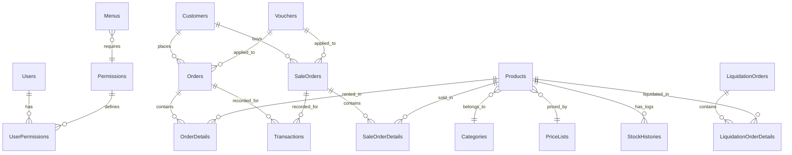

# TÀI LIỆU BÀN GIAO & VẬN HÀNH HỆ THỐNG
## HỆ THỐNG QUẢN LÝ THUÊ VÀ BÁN TRANG PHỤC (CLOTHING RENTAL SYSTEM)

Tài liệu này cung cấp toàn bộ thông tin kỹ thuật, kiến trúc cơ sở dữ liệu, cấu hình máy chủ, thông tin truy cập và hướng dẫn quản lý hệ thống nhằm giúp khách hàng/quản trị viên tự vận hành và bảo trì hệ thống một cách độc lập.

---

## 1. KIẾN TRÚC HỆ THỐNG (SYSTEM ARCHITECTURE)

Hệ thống được thiết kế theo mô hình Monolith hiện đại, tối ưu hiệu năng và dễ dàng triển khai:
* **Presentation Layer:** ASP.NET Core Razor Pages (.NET 10), giao diện responsive (tương thích tốt với máy tính, máy tính bảng và điện thoại di động) sử dụng CSS Glassmorphism cao cấp.
* **Business Logic Layer:** Cấu trúc Service-Oriented (DI Scoped) xử lý toàn bộ nghiệp vụ thuê, bán, thanh lý, thống kê và gửi thông báo.
* **Data Access Layer:** Entity Framework Core với nhà cung cấp cơ sở dữ liệu PostgreSQL.
* **Background Services:** `TelegramBotService` chạy ngầm để gửi thông báo real-time và hỗ trợ người dùng liên kết tài khoản.
* **File Storage:** Hình ảnh sản phẩm và đơn hàng được tải lên và lưu trữ tại thư mục tĩnh cục bộ `/wwwroot/uploads` (được bảo toàn qua Docker Volume).

---

## 2. KIẾN TRÚC CƠ SỞ DỮ LIỆU (DATABASE SCHEMA)

Cơ sở dữ liệu được tổ chức trên hệ quản trị **PostgreSQL**. Dưới đây là mô tả chi tiết các bảng và mối quan hệ chính:

### a. Sơ đồ các bảng dữ liệu chính


### b. Chi tiết các bảng (Tables)
1. **Users (Người dùng):** Lưu thông tin tài khoản nhân viên và quản trị viên.
   - `Id` (SERIAL, PK): Mã người dùng.
   - `Username` (VARCHAR): Tên đăng nhập (Unique).
   - `PasswordHash` (TEXT): Mật khẩu đã được mã hóa bằng PBKDF2.
   - `Role` (VARCHAR): Quyền hạn chính (`Admin` hoặc `Staff`).
   - `FullName` (VARCHAR): Họ và tên đầy đủ.
   - `TelegramId` (VARCHAR, Nullable): ID tài khoản Telegram cá nhân dùng để nhận thông báo.
2. **Permissions (Quyền hạn):** Danh sách các quyền năng cụ thể (ví dụ: `ORDER_CREATE`, `REPORT_VIEW`...).
3. **UserPermissions (Bảng trung gian):** Liên kết nhiều-nhiều giữa `Users` và `Permissions`.
4. **Menus (Thanh điều hướng):** Lưu danh mục chức năng hiển thị trên Sidebar dựa trên quyền hạn người dùng.
5. **Customers (Khách hàng):** Thông tin khách thuê/mua đồ.
   - `PhoneNumber` (VARCHAR): Số điện thoại (Unique - dùng làm khóa định danh tìm kiếm nhanh).
   - `IdentityCard` (VARCHAR, Nullable): Số CCCD.
6. **Categories (Danh mục loại hàng):** Ví dụ: Váy cưới, Vest, Áo dài.
   - `CodePrefix` (VARCHAR): Tiếp đầu ngữ tự động sinh mã sản phẩm (Ví dụ: `VC`, `VS`, `AD`).
7. **PriceLists (Bảng giá sản phẩm):** Quy định giá thuê 1 ngày và tiền cọc cho từng nhóm chất lượng đồ.
8. **Products (Sản phẩm/Mặt hàng):**
   - `Code` (VARCHAR, PK): Mã vạch sản phẩm (Barcode). Công thức sinh tự động: `[Prefix] + [yyyyMMdd] + [4 số tự tăng]`.
   - `StockQuantity` (INTEGER): Số lượng tồn kho thực tế.
   - `WarningStockLevel` (INTEGER): Mức cảnh báo tồn kho tối thiểu.
   - `IsLiquidated` (BOOLEAN): Trạng thái đã thanh lý hoàn toàn hay chưa.
9. **Orders & OrderDetails (Đơn thuê hàng & Chi tiết dòng):**
   - Lưu trữ thông tin ngày thuê (`RentDate`), ngày hẹn trả (`DueDate`), ngày trả thực tế (`ActualReturnDate`), tiền cọc, tiền thuê, phí phát sinh trễ hạn hoặc hỏng đồ (`PenaltyFee`), lý do phạt.
   - Trạng thái (`Status`): `Draft` (Nháp), `Rented` (Đang thuê), `PartiallyReturned` (Trả một phần), `Closed` (Đã hoàn thành/Đóng), `Overdue` (Quá hạn).
10. **SaleOrders & SaleOrderDetails (Đơn xuất bán đứt & Chi tiết dòng):** Lưu vết giao dịch mua đứt trang phục của khách hàng.
11. **LiquidationOrders & LiquidationOrderDetails (Đơn thanh lý sản phẩm):** Lưu vết các trang phục bị hư hỏng, quá hạn sử dụng cần loại bỏ khỏi kho.
12. **Transactions (Giao dịch tài chính):** Ghi nhận dòng tiền thực tế thu/chi liên quan đến đơn hàng (Tiền cọc, tiền thuê, tiền thanh lý, hoàn cọc).
13. **Vouchers (Mã giảm giá):** Hỗ trợ chiết khấu theo số tiền cố định (`FIXED`) hoặc phần trăm (`PERCENT`), áp đặt giá trị tối thiểu của đơn hàng (`MinOrderAmount`) và mức giảm tối đa (`MaxDiscountAmount`).
14. **SystemSettings (Cấu hình hệ thống):** Lưu cấu hình dưới dạng JSON (Ví dụ: Cài đặt Telegram Bot).

---

## 3. THÔNG TIN MÔI TRƯỜNG & HÌNH THỨC TRIỂN KHAI (HOSTING & DEPLOYMENT)

### a. Thông tin truy cập hạ tầng hiện tại
* **Cơ sở dữ liệu (PostgreSQL):**
  - **Địa chỉ Host:** `163.61.73.83`
  - **Cổng kết nối:** `5432`
  - **Tên Database:** `ClothingRental`
  - **Tài khoản:** `postgres`
  - **Mật khẩu:** `123123@`
* **API Settings (Kết nối ngoài):**
  - **Base URL:** `https://api.clothingrental.example.com/api/`
* **Giao diện Web:**
  - Chạy Docker local lắng nghe tại: [http://127.0.0.1:8080](http://127.0.0.1:8080)
  - Triển khai Production tự động trên Cloud (hỗ trợ đọc cổng động thông qua biến môi trường `${PORT}`).

### b. Cách thức Triển khai bằng Docker
Dự án đã tích hợp sẵn `Dockerfile` và `docker-compose.yml` ở thư mục gốc.

* **Dockerfile (3-stage build tối ưu kích thước):**
  - Stage 1: Sử dụng SDK `.NET 10.0` để biên dịch mã nguồn ở chế độ Release.
  - Stage 2: Publish ứng dụng loại bỏ các file thừa.
  - Stage 3: Sử dụng ASP.NET Runtime `10.0` siêu nhẹ để chạy file `ClothingRentalUI.dll` trên cổng động cấu hình.

* **Khởi chạy ứng dụng bằng Docker Compose:**
  Để khởi chạy hoặc cập nhật hệ thống, truy cập thư mục chứa mã nguồn chạy lệnh:
  ```powershell
  # Build lại image mới nhất và chạy ngầm container
  docker-compose up -d --build
  ```

* **Dữ liệu bền vững (Data Persistence):**
  Tất cả ảnh tải lên đơn hàng và sản phẩm được lưu trong Docker Volume có tên `uploads-data`, liên kết với thư mục `/app/wwwroot/uploads` bên trong container. Việc nâng cấp hoặc khởi động lại container **sẽ không làm mất hình ảnh đã tải lên**.

---

## 4. TÀI KHOẢN MẶC ĐỊNH & THIẾT LẬP BAN ĐẦU

### a. Tài khoản quản trị hệ thống tối cao (Super Admin)
Ngay khi khởi chạy cơ sở dữ liệu mới, hệ thống tự động sinh tài khoản Admin mặc định nếu chưa tồn tại:
* **Tên đăng nhập (Username):** `admin`
* **Mật khẩu (Password):** `admin`
> [!WARNING]
> **Khuyến nghị bảo mật:** Quản trị viên cần đăng nhập ngay vào hệ thống, truy cập trang **Trang cá nhân** (`/Settings/Profile`) để thay đổi mật khẩu mặc định nhằm tránh rủi ro xâm nhập.

### b. Thiết lập Telegram Bot thông báo
Hệ thống hỗ trợ gửi tin nhắn tự động khi phát sinh đơn thuê, đơn trả, hoặc cảnh báo tồn kho.
1. Tạo một Bot mới trên Telegram thông qua `@BotFather` để lấy **Bot Token**.
2. Đăng nhập tài khoản `admin` trên Web, vào **Cấu hình hệ thống** -> Tìm cài đặt **Telegram Bot**.
3. Điền các thông tin:
   - `BotToken`: Chuỗi Token nhận từ BotFather.
   - `Enabled`: Bật/Tắt tính năng thông báo ngầm.
4. Để nhân viên nhận được thông báo cá nhân, nhân viên cần gửi tin nhắn `/start connect_[UserId]` (Ví dụ: `/start connect_1`) trực tiếp đến Bot Telegram của cửa hàng. Hệ thống sẽ tự động liên kết tài khoản Telegram với tài khoản hệ thống.

---

## 5. HƯỚNG DẪN VẬN HÀNH & BẢO TRÌ HẰNG NGÀY

### a. Quy tắc tính tiền thuê & phạt phát sinh trễ hạn (Tự động)
Hệ thống áp dụng quy tắc mặc định theo yêu cầu nghiệp vụ:
* **Giá thuê tính theo block ngày:** Ngày thuê thực tế được tính bằng: `Ngày trả - Ngày thuê`.
* **Miễn phí gia hạn ngắn:** Trả đồ trong ngày tiếp theo không bị tính phí phát sinh (ví dụ thuê ngày 1, trả ngày 2 vẫn tính là 1 ngày thuê).
* **Phí trễ hạn cơ bản:** Kể từ ngày trễ hạn đầu tiên, cộng thêm `10,000 VND / ngày` trên mỗi sản phẩm trễ.
* **Quy tắc lặp chu kỳ giá:** Sang ngày trễ hạn thứ 4, hệ thống tự động cộng thêm 1 lần giá thuê gốc của sản phẩm đó và tiếp tục tích lũy.

### b. Nhập sản phẩm hàng loạt bằng Excel
Quản trị viên có thể nhập danh sách sản phẩm nhanh từ Excel tại trang **Danh sách sản phẩm**:
1. Tải file mẫu Excel từ hệ thống.
2. Điền thông tin sản phẩm: Tên, Số lượng, Loại sản phẩm (Prefix tương ứng), Loại giá.
3. Tải file lên hệ thống. Hệ thống sẽ tự động đối chiếu:
   - Nếu Loại hàng hoặc Loại giá trong file Excel chưa tồn tại, hệ thống tự động tạo mới loại hàng và loại giá tương ứng trong DB.
   - Tự sinh mã Barcode duy nhất cho từng sản phẩm mới tạo.

### c. Sao lưu và khôi phục Cơ sở dữ liệu (PostgreSQL Backup)
Để phòng ngừa sự cố mất mát dữ liệu, quản trị viên nên lập lịch sao lưu cơ sở dữ liệu định kỳ.
* **Lệnh sao lưu (Backup):**
  ```powershell
  pg_dump -h 163.61.73.83 -U postgres -d ClothingRental -F c -b -v -f clothing_rental_backup.bak
  ```
* **Lệnh khôi phục (Restore):**
  ```powershell
  pg_restore -h 163.61.73.83 -U postgres -d ClothingRental -v clothing_rental_backup.bak
  ```

---
*Tài liệu bàn giao kết thúc. Mọi thay đổi về cấu trúc mã nguồn hoặc thông tin máy chủ sau ngày bàn giao cần được cập nhật bổ sung vào tài liệu này.*
